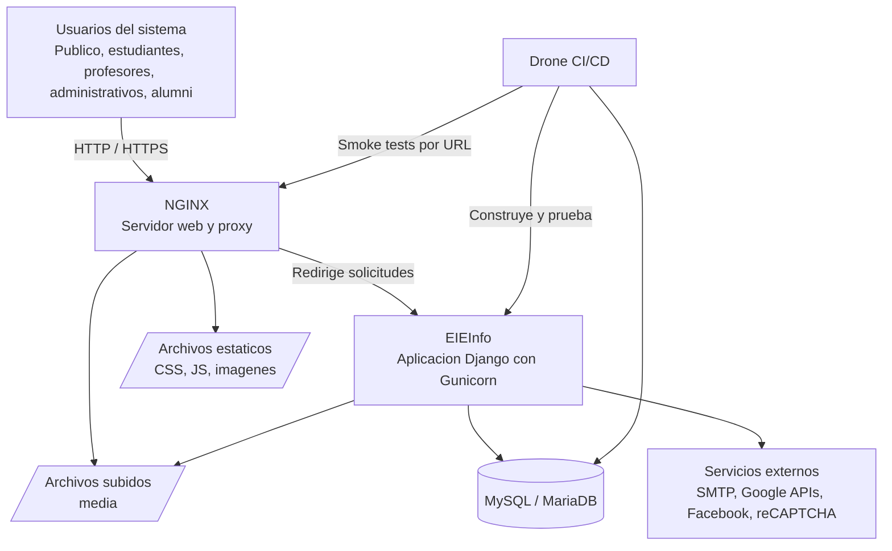
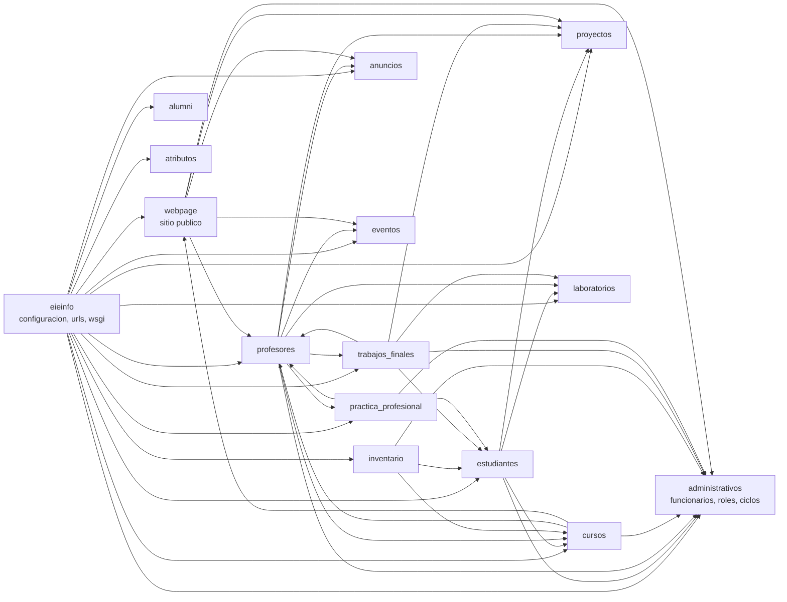

# Universidad de Costa Rica

# Ingeniería Electrica

# Auditoría de Diseño de Software del Sistema EIEInfo

## Entrega 1: Levantamiento del sistema y diagnóstico inicial

### Curso: IE0417 Diseño de Software para Ingeniería

### Estudiante: Jesy Pricilla Rivera Duarte

### Carnet: C06512

### Fecha: 9 de junio de 2026

---

### 1. Introduccion

En esta entrega se realizo un levantamiento inicial del sistema EIEInfo, un sistema de informacion para la Escuela de Ingenieria Electrica. El analisis se baso en la estructura del repositorio, los archivos de configuracion, las rutas, los modelos, las vistas, los tests y la documentacion incluida en el proyecto.

El objetivo de esta auditoria fue entender como esta construido el sistema, cuales son sus modulos principales, como se despliega y que riesgos iniciales existen. El enfasis del diagnostico se coloco en testabilidad, confiabilidad, mantenibilidad, deuda tecnica, complejidad y acoplamiento.

El enfoque utilizado fue principalmente estatico. Esto significa que se revisaron archivos del repositorio sin modificar el codigo fuente. Se usaron como evidencia archivos como `README.md`, `docker/README.md`, `docker-compose.yml`, `requirements.txt`, `src/server/eieinfo/settings.py`, `src/server/eieinfo/urls.py`, los archivos `tests.py` y la configuracion de integracion continua en `.drone.yml`.

### 2. Ficha tecnica del sistema

| Elemento | Tecnologia encontrada | Funcion dentro del sistema | Evidencia |
|---|---|---|---|
| Lenguaje principal | Python | Permite implementar la logica del backend, modelos, vistas, formularios y pruebas. | `.python-version`, `src/server/manage.py` |
| Framework web | Django | Organiza el sistema en aplicaciones, rutas, modelos, vistas, plantillas y administracion. | `src/server/eieinfo/settings.py`, `src/server/manage.py` |
| Version de Django | Historicamente Django 1.9.1, pero `requirements.txt` fija Django 4.1.3 | Existe una mezcla entre documentacion antigua y dependencias mas recientes. Esto puede generar confusion al mantener el sistema. | `README.md`, `requirements.txt`, `src/server/eieinfo/settings.py` |
| Base de datos | MySQL / MariaDB | Guarda la informacion principal del sistema: estudiantes, profesores, cursos, eventos, inventario, practicas y otros datos. | `README.md`, `docker-compose.yml`, `docker/django/secret_credentials.py` |
| Servidor de aplicacion | Gunicorn | Ejecuta la aplicacion Django en produccion o en Docker. Gunicorn recibe las solicitudes que NGINX le envia. | `docker-compose.yml`, `conf/etc/systemd/system/eieinfo.service` |
| Servidor web / proxy | NGINX | Recibe solicitudes HTTP, sirve archivos estaticos y redirige trafico hacia Gunicorn. | `docker/nginx/default.conf`, `conf/etc/nginx/sites-available/eieinfo` |
| Contenedores | Docker Compose | Levanta un ambiente con base de datos, NGINX y la aplicacion Django. | `docker-compose.yml`, `docker/README.md` |
| CI/CD | Drone | Automatiza construccion, pruebas, smoke tests y despliegue. Un smoke test revisa que varias URLs respondan correctamente. | `.drone.yml`, `docker/drone-local/drone.yml` |
| Pruebas | Django `TestCase`, `TransactionTestCase`, pytest configurado | Permiten validar rutas, formularios, vistas y algunos flujos de negocio. | `src/server/pytest.ini`, `src/server/*/tests.py` |
| Integraciones externas | SMTP, Google APIs, Facebook API, reCAPTCHA | Permiten envio de correos, busquedas, publicacion en redes o validaciones externas. | `src/server/eieinfo/settings.py`, `docker/django/secret_credentials.py`, `requirements.txt` |
| Arquitectura predominante | Monolito Django modular | Es un solo sistema Django dividido en varias apps internas. Un monolito significa que el sistema se despliega como una sola aplicacion, aunque este organizado en modulos. | `src/server/eieinfo/settings.py`, `src/server/eieinfo/urls.py` |

### 3. Mapa general del sistema

El repositorio esta organizado alrededor de un backend Django ubicado en `src/server/`. Dentro de esa carpeta se encuentran varias aplicaciones Django, como `profesores`, `estudiantes`, `administrativos`, `cursos`, `webpage`, `inventario`, `practica_profesional`, `trabajos_finales`, `proyectos`, `laboratorios`, `anuncios` y `eventos`.

La aplicacion central se llama `eieinfo`. Esta contiene la configuracion principal del sistema, como las aplicaciones instaladas, rutas principales, archivos estaticos, configuracion de correo, configuracion de produccion y carga de credenciales. El archivo `src/server/eieinfo/settings.py` registra las apps internas en `INSTALLED_APPS`, y `src/server/eieinfo/urls.py` conecta las rutas principales del sistema con cada modulo.

El backend funciona con el patron tipico de Django:

- Los modelos representan datos de la base de datos.
- Las vistas reciben solicitudes web y preparan respuestas.
- Las rutas conectan URLs con vistas.
- Las plantillas generan HTML para el usuario.
- Los formularios validan informacion ingresada por el usuario.

La base de datos principal es MySQL/MariaDB. En Docker, el servicio `db` levanta MariaDB y expone el puerto `3307` hacia el sistema anfitrion. La aplicacion Django se conecta a esa base por medio de la configuracion en `docker/django/secret_credentials.py`.

La infraestructura de despliegue se divide en tres partes principales:

1. `db`: base de datos MariaDB.
2. `eieinfo_app`: aplicacion Django ejecutada con Gunicorn.
3. `nginx`: servidor web que recibe las solicitudes y las envia a la aplicacion.

En produccion tambien se documenta una configuracion con NGINX, Gunicorn y systemd. NGINX sirve `/static/` y `/media/`, mientras que Gunicorn ejecuta `eieinfo.wsgi`.

### 4. Diagramas

#### 4.1 Diagrama de contexto (Mermaid)

Este diagrama muestra el sistema desde afuera. Los usuarios ingresan por NGINX, que actua como entrada principal. Luego NGINX envia las solicitudes a la aplicacion Django. La aplicacion usa la base de datos para leer y guardar informacion, tambien usa archivos estaticos y archivos subidos por usuarios. Ademas, algunas funciones dependen de servicios externos, como correo o APIs.

#### 4.2 Diagrama de modulos/contenedores (Mermaid)

Este diagrama muestra las relaciones internas. `eieinfo` es el modulo central porque registra y conecta las apps. `administrativos`, `profesores`, `estudiantes` y `cursos` son modulos muy importantes porque muchos otros dependen de ellos. Por ejemplo, `trabajos_finales` depende de estudiantes, profesores, administrativos, proyectos y laboratorios.

### 5. Inventario funcional

#### Actores del sistema

| Actor | Funcion principal | Evidencia |
|---|---|---|
| Publico general | Consulta paginas publicas, cursos, profesores, eventos, anuncios, proyectos y laboratorios. | `webpage/urls.py`, `eieinfo/urls.py` |
| Estudiante | Usa perfil, cursos, asistencias, tramites, practica profesional, proyecto electrico, TFG y bodega. | `estudiantes/urls.py`, `estudiantes/misc.py` |
| Profesor | Gestiona perfil, cursos, asistencias, noticias, publicaciones, proyectos, laboratorios, practica profesional y TFG. | `profesores/urls.py`, `profesores/misc.py` |
| Administrativo | Gestiona estudiantes, inventario, noticias, lugares, reservas, asistencias y consejo asesor. | `administrativos/urls.py`, `administrativos/misc.py` |
| Encargado de bodega | Gestiona prestamos, devoluciones y solicitudes relacionadas con activos o peculios. | `inventario/urls.py`, `inventario/misc.py` |
| Alumni | Usa perfil de egresado y bolsa de empleo. | `alumni/urls.py`, `alumni/misc.py` |
| Empresa externa | Responde formularios de practica profesional mediante enlaces con token. | `practica_profesional/views.py` |
| Administrador Django | Usa `/admin/` para administrar modelos directamente. | `eieinfo/urls.py` |

#### Areas funcionales principales

| Area | Funcion |
|---|---|
| Sitio publico | Presenta informacion institucional, contacto, personal, publicaciones, laboratorios, proyectos, preguntas frecuentes y recursos. |
| Estudiantes | Gestiona acceso estudiantil, perfil, cursos, asistencias, practica profesional, bodega y trabajos finales. |
| Profesores | Gestiona funciones docentes, cursos, publicaciones, proyectos, asistencias, consejo asesor y trabajos finales. |
| Administrativos | Administra informacion academica y operativa, como estudiantes, inventario, lugares, reservas y noticias. |
| Cursos | Maneja cursos, grupos, planes de estudio, catedras y horarios. |
| Inventario | Maneja bienes, activos, computadoras, peculios, prestamos y solicitudes. |
| Practica profesional | Controla solicitudes, requisitos, empresas, revisiones, cartas y cierres de practica. |
| Trabajos finales | Maneja proyectos electricos, TFG, concursos, lectores, avances y presentaciones. |
| Noticias y eventos | Permite publicar anuncios y eventos visibles para distintos publicos. |

#### Modulos criticos

| Modulo | Razon por la que es critico |
|---|---|
| `eieinfo` | Contiene configuracion general, rutas principales y WSGI. Si falla, el sistema no inicia. |
| `administrativos` | Contiene funcionarios, roles, ciclos, lugares y permisos usados por otros modulos. |
| `profesores` | Concentra flujos docentes y muchas funciones del consejo asesor. |
| `estudiantes` | Maneja identidad estudiantil y procesos academicos sensibles. |
| `cursos` | Es base para estudiantes, profesores, inventario y atributos. |
| `inventario` | Controla activos fisicos y prestamos. |
| `trabajos_finales` | Maneja procesos academicos importantes como TFG y proyecto electrico. |
| `practica_profesional` | Integra estudiantes, profesores, administrativos y empresas externas. |
| `webpage` | Es la entrada publica del sistema y agrega informacion de muchos modulos. |

### 6. Diagnostico inicial con enfasis en testabilidad y confiabilidad

La testabilidad indica que tan facil es probar un sistema. Es importante porque permite hacer cambios con menor riesgo. Si un sistema tiene buenas pruebas, los desarrolladores pueden detectar errores antes de afectar a los usuarios.

En EIEInfo se encontraron pruebas con `django.test.TestCase`, `TransactionTestCase` y configuracion de `pytest`. Sin embargo, la ejecucion real en CI usa `python manage.py test`. Esto muestra que pytest esta configurado, pero no parece ser el camino principal de ejecucion.

Se encontraron archivos `tests.py` en varios modulos. Los modulos con mayor cantidad de pruebas observables son:

- `profesores`
- `administrativos`
- `webpage`
- `estudiantes`
- `practica_profesional`
- `cursos`
- `asistencias`

Tambien existen pruebas para `atributos` y `proyecto_electrico`.

Las partes con menor cobertura o sin pruebas propias son:

- `anuncios`
- `eventos`
- `inventario`
- `laboratorios`
- `proyectos`
- `conferencias`
- `alumni`, que tiene un archivo de pruebas vacio
- `trabajos_finales`, que tambien tiene un archivo de pruebas vacio

Un punto importante es que `.drone.yml` solo ejecuta pruebas de `profesores`, `administrativos`, `estudiantes`, `cursos` y `webpage`. Esto deja por fuera pruebas existentes de `practica_profesional`, `asistencias`, `atributos` y `proyecto_electrico`.

Tambien se observo que las pruebas dependen bastante de fixtures generadas con `dumpdata`. Una fixture es un archivo con datos usados para preparar la base de datos de pruebas. Si esos datos cambian mucho o dependen del estado del ambiente, las pruebas pueden volverse dificiles de reproducir.

No se encontro una configuracion formal de cobertura de codigo. La cobertura indica que porcentaje del codigo es ejecutado por las pruebas. Sin esta metrica, no se puede saber con precision que partes del sistema estan bien probadas.

### 7. Hallazgos iniciales

#### H-01 CI ejecuta solo una parte de las pruebas

**Descripcion**

El pipeline de Drone ejecuta pruebas unicamente para algunos modulos. Aunque existen pruebas en otros modulos, estas no aparecen en la lista de ejecucion principal del CI.

**Evidencia**

Archivo `.drone.yml`, donde se ejecutan `python manage.py test profesores`, `administrativos`, `estudiantes`, `cursos` y `webpage`.

**Impacto**

Errores en modulos como `practica_profesional`, `asistencias`, `atributos` o `proyecto_electrico` podrian llegar al sistema sin ser detectados.

**Criticidad**

Alta.

**Recomendacion inicial**

Ejecutar todas las pruebas disponibles en CI o usar un comando general como `python manage.py test`.

#### H-02 Modulos criticos sin pruebas propias

**Descripcion**

Varios modulos registrados en el sistema no tienen archivo `tests.py` propio. Algunos pueden estar cubiertos de forma indirecta, pero no cuentan con pruebas especificas.

**Evidencia**

Apps como `anuncios`, `eventos`, `inventario`, `laboratorios`, `proyectos` y `conferencias` estan registradas en `settings.py`, pero no tienen pruebas propias observables.

**Impacto**

Los cambios en esos modulos podrian romper funcionalidades sin que las pruebas lo detecten.

**Criticidad**

Alta.

**Recomendacion inicial**

Crear pruebas minimas por modulo para rutas principales, modelos importantes y permisos.

#### H-03 Archivos de prueba vacios

**Descripcion**

Los modulos `alumni` y `trabajos_finales` tienen archivos de prueba que practicamente no contienen pruebas reales.

**Evidencia**

`src/server/alumni/tests.py` y `src/server/trabajos_finales/tests.py`.

**Impacto**

Puede dar la impresion de que esos modulos estan cubiertos, cuando en realidad no lo estan.

**Criticidad**

Alta.

**Recomendacion inicial**

Agregar pruebas reales o documentar explicitamente que esos modulos no tienen cobertura.

#### H-04 Divergencia entre CI y scripts locales

**Descripcion**

El archivo `.drone.yml` ejecuta varias suites de pruebas, pero el script `docker/django/run-ut.sh` comenta algunas y senala que `profesores` falla.

**Evidencia**

`docker/django/run-ut.sh` y `.drone.yml`.

**Impacto**

Un desarrollador puede validar localmente un conjunto distinto de pruebas al que se ejecuta en CI.

**Criticidad**

Alta.

**Recomendacion inicial**

Definir un unico comando oficial de pruebas y usarlo tanto localmente como en CI.

#### H-05 Dependencia fuerte de fixtures generadas

**Descripcion**

Las pruebas dependen de fixtures generadas con `dumpdata` durante el pipeline.

**Evidencia**

`.drone.yml` y `docker/django/run-ut.sh`.

**Impacto**

Los resultados de las pruebas pueden depender del estado de la base de datos del entorno.

**Criticidad**

Alta.

**Recomendacion inicial**

Crear datos de prueba controlados con fixtures versionadas o con metodos como `setUpTestData`.

#### H-06 Alto acoplamiento entre modulos

**Descripcion**

Se observan dependencias directas entre múltiples aplicaciones Django mediante relaciones e importaciones cruzadas.

**Evidencia**

`estudiantes/models.py`, `trabajos_finales/models.py`, `inventario/models.py`, `cursos/models.py`.

**Impacto**

Un cambio en un modulo puede afectar otros modulos. Ademas, probar una parte aislada se vuelve mas dificil.

**Criticidad**

Alta.

**Recomendacion inicial**

Identificar dependencias comunes y mover reglas compartidas a servicios o funciones auxiliares mas claras.

#### H-07 Autenticacion simulada manualmente en tests

**Descripcion**

Varias pruebas colocan directamente valores en la sesion, como `est_id`, `prof_id` o `admn_id`, para simular usuarios autenticados.

**Evidencia**

`estudiantes/tests.py`, `profesores/tests.py`, `administrativos/tests.py`.

**Impacto**

Puede que las pruebas no cubran correctamente el flujo real de autenticacion y permisos.

**Criticidad**

Media-Alta.

**Recomendacion inicial**

Crear helpers de autenticacion reutilizables o pruebas que usen el flujo real de login.

#### H-08 Pruebas dependientes de texto exacto

**Descripcion**

Muchas pruebas verifican que ciertas palabras aparezcan en el HTML.

**Evidencia**

`webpage/tests.py`, `cursos/tests.py`.

**Impacto**

Cambios pequenos en textos o diseno pueden romper pruebas aunque la funcionalidad siga correcta.

**Criticidad**

Media.

**Recomendacion inicial**

Priorizar validaciones sobre estado HTTP, contexto, objetos creados, permisos y redirecciones.

#### H-09 No se observo medicion formal de cobertura

**Descripcion**

No se encontro configuracion como `.coveragerc`, `coverage.xml` o dependencia clara de coverage.

**Evidencia**

`requirements.txt` solo incluye `pytest` y `pytest-django` como herramientas de prueba.

**Impacto**

No se puede saber con precision que porcentaje del codigo esta probado.

**Criticidad**

Media-Alta.

**Recomendacion inicial**

Agregar `coverage.py` o `pytest-cov` y generar reportes en CI.

#### H-10 Documentacion y dependencias no estan alineadas

**Descripcion**

El README menciona Django 1.9.1, pero `requirements.txt` fija Django 4.1.3. Ademas, `settings.py` conserva comentarios de Django 1.9.

**Evidencia**

`README.md`, `requirements.txt`, `src/server/eieinfo/settings.py`.

**Impacto**

Puede causar confusion al instalar, mantener o actualizar el sistema.

**Criticidad**

Media.

**Recomendacion inicial**

Actualizar la documentacion para reflejar la version real soportada.

#### H-11 Dependencias externas dificultan pruebas aisladas

**Descripcion**

El sistema usa correo, Google APIs, Facebook API y reCAPTCHA. Estas dependencias deben aislarse durante pruebas.

**Evidencia**

`settings.py`, `docker/django/secret_credentials.py`, `requirements.txt`.

**Impacto**

Las pruebas podrian fallar por problemas externos o por configuracion del ambiente.

**Criticidad**

Media.

**Recomendacion inicial**

Centralizar esas integraciones y usar mocks en pruebas.

#### H-12 Controladores extensos y con muchas responsabilidades

**Descripcion**

Algunas vistas concentran muchos flujos, reglas y permisos. Esto se observa especialmente en practica profesional y consejo asesor.

**Evidencia**

`practica_profesional/views.py`, `profesores/views/consejo_asesor.py`.

**Impacto**

El codigo es mas dificil de entender, modificar y probar.

**Criticidad**

Media-Alta.

**Recomendacion inicial**

Extraer logica de negocio a servicios pequenos y probar esos servicios por separado.

### 8. Matriz preliminar de riesgos

| Riesgo | Causa | Impacto | Probabilidad | Prioridad |
|---|---|---|---|---|
| Regresiones no detectadas en modulos criticos | CI ejecuta solo una parte de las pruebas | Alto | Alta | Critica |
| Falsa sensacion de cobertura | Existen archivos de prueba vacios | Alto | Alta | Alta |
| Fallos en modulos sin pruebas propias | Apps registradas no tienen suite especifica | Alto | Media-Alta | Alta |
| Pruebas no reproducibles | Fixtures generadas desde el estado de la base de datos | Alto | Alta | Critica |
| Validacion local distinta a CI | Scripts locales y CI no ejecutan lo mismo | Medio-Alto | Alta | Alta |
| Efectos laterales por acoplamiento | Muchos imports directos entre apps | Alto | Media-Alta | Alta |
| Permisos mal cubiertos | Tests simulan sesion manualmente | Alto | Media | Alta |
| Pruebas fragiles por texto | Uso frecuente de `assertContains` sobre contenido HTML | Medio | Alta | Media-Alta |
| Falta de medicion objetiva | No hay reporte formal de cobertura | Medio-Alto | Alta | Alta |
| Confusion en mantenimiento | Documentacion y dependencias no coinciden | Medio-Alto | Media | Alta |
| Fallos por servicios externos | SMTP, APIs y reCAPTCHA no siempre estan aislados | Medio-Alto | Media | Media-Alta |
| Complejidad en vistas grandes | Controladores concentran muchas reglas | Alto | Media | Alta |

Los riesgos mas importantes son los relacionados con pruebas incompletas, fixtures dependientes del ambiente y alto acoplamiento. Estos riesgos son prioritarios porque afectan directamente la capacidad de modificar el sistema sin romper funcionalidades existentes.

### 9. Conclusiones

Se encontro un sistema web monolitico construido con Django, organizado en varias aplicaciones internas. El sistema tiene una estructura funcional amplia y cubre procesos importantes de la Escuela de Ingenieria Electrica, como gestion de estudiantes, profesores, cursos, inventario, trabajos finales, practica profesional, noticias y contenido publico.

Una fortaleza importante es que el sistema esta dividido en modulos por dominio. Esto ayuda a ubicar funcionalidades. Tambien se encontro documentacion en varios modulos y una infraestructura Docker que permite levantar un ambiente parecido al de produccion. Ademas, existen pruebas para varios flujos relevantes, especialmente en `profesores`, `administrativos`, `estudiantes`, `webpage`, `cursos`, `asistencias` y `practica_profesional`.

La principal debilidad es que la cobertura de pruebas no es uniforme. Algunos modulos tienen muchas pruebas, otros tienen pruebas vacias y otros no tienen pruebas propias. Ademas, el CI no ejecuta todas las pruebas existentes. Esto reduce la confiabilidad del sistema ante cambios.

Otro problema importante es el acoplamiento entre modulos. Muchos modelos y vistas dependen directamente de otras apps. Esto hace que los cambios sean mas riesgosos y que las pruebas necesiten preparar muchos datos relacionados.

Tambien se encontro deuda tecnica en la documentacion y configuracion. La documentacion menciona Django 1.9.1, mientras que las dependencias actuales indican Django 4.1.3. Esta diferencia debe aclararse para evitar errores de instalacion y mantenimiento.

Los riesgos mas importantes son: regresiones no detectadas, pruebas fragiles por datos de ambiente, falta de cobertura formal, dependencias externas dificiles de aislar y complejidad en controladores grandes.

Para la siguiente entrega, deberian analizarse con mas profundidad las siguientes areas:

- Cobertura real de pruebas por modulo.
- Flujos de autenticacion y permisos.
- Modulos criticos sin pruebas propias.
- Dependencias entre apps Django.
- Complejidad de vistas extensas.
- Separacion de logica de negocio en servicios.
- Consistencia entre documentacion, Docker, CI y configuracion real del sistema.
