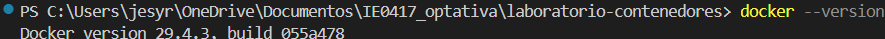
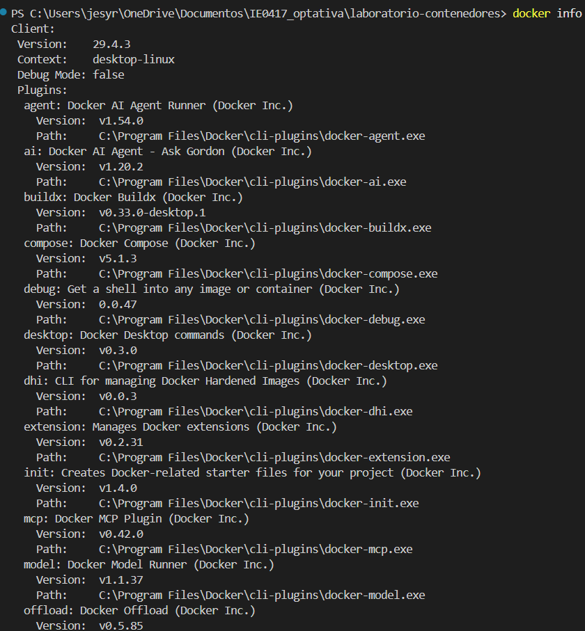
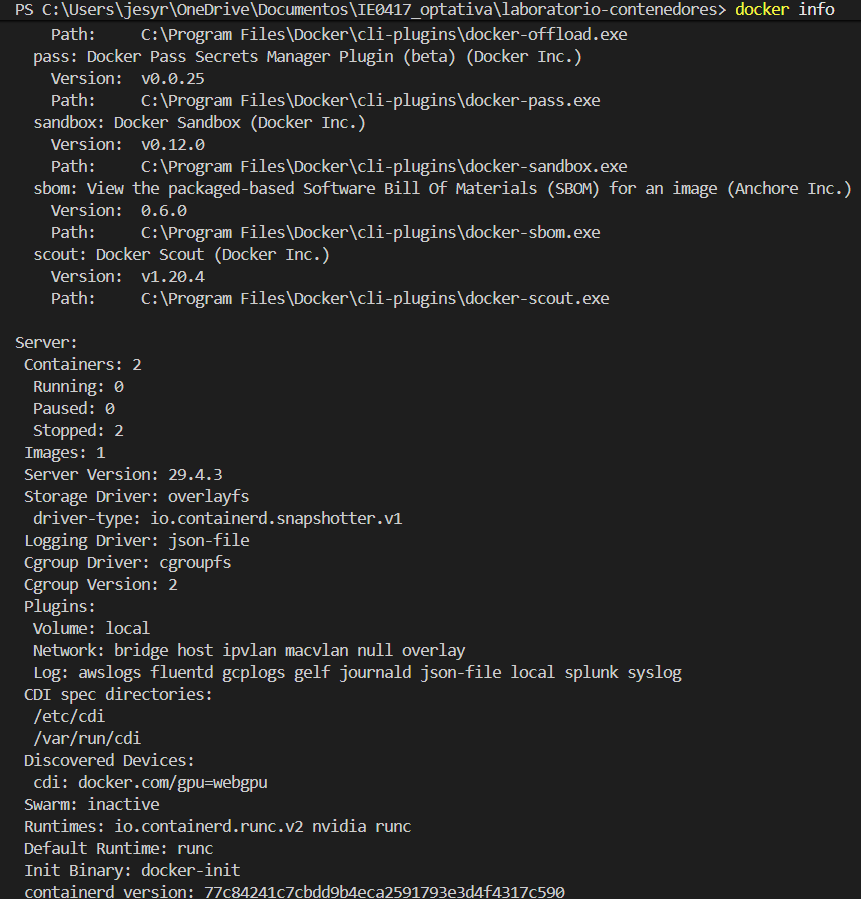
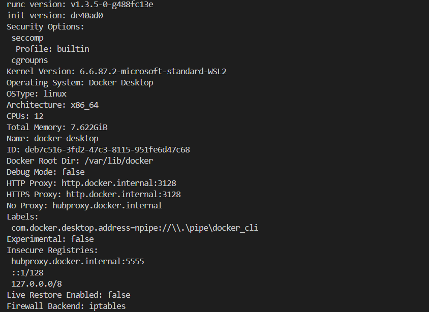
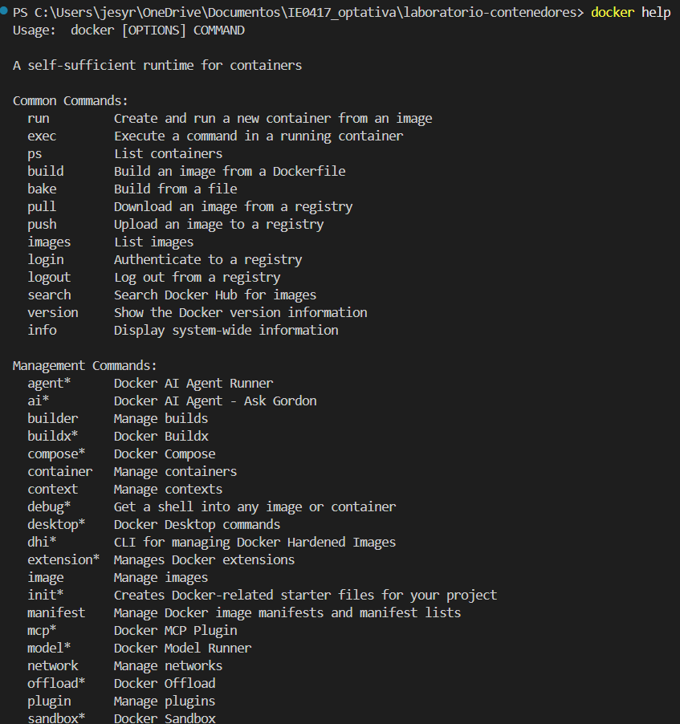
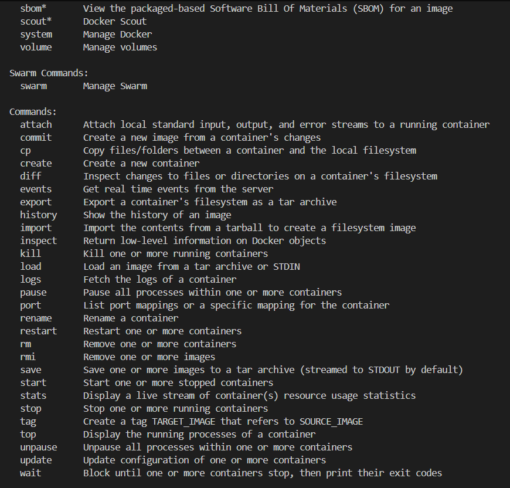
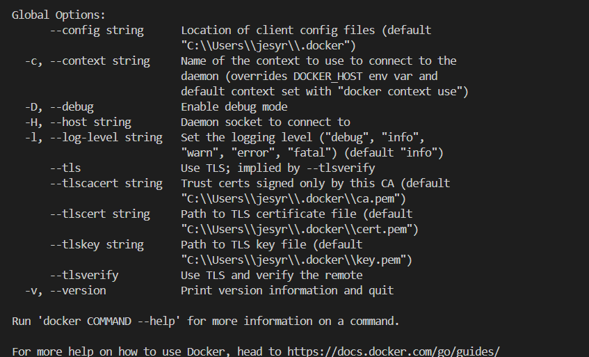

# Laboratorio 2 – Parte 1: Verificación de instalación de Docker

## Nombre de la estudiante
Jesy Pricilla Rivera Duarte


## Objetivo

Verificar que Docker está instalado correctamente y que es posible ejecutar comandos básicos desde la terminal.

---

# Sistema operativo utilizado

El laboratorio fue realizado en Windows 11 utilizando PowerShell desde Visual Studio Code. Docker se ejecutó mediante Docker Desktop con integración a WSL2.

---

# Verificación de versión de Docker

## Comando ejecutado

```powershell
docker --version
```

## Explicación

Este comando permite verificar si Docker está instalado correctamente y muestra la versión actual instalada en el sistema.

## Resultado obtenido

```text
Docker version 29.4.3, build 055a478
```

## Evidencia



## Reflexión

Este comando es útil porque permite comprobar rápido que Docker está instalado y disponible desde la terminal antes de comenzar el laboratorio.

---

# Información de Docker

## Comando ejecutado

```powershell
docker info
```

## Explicación

Este comando muestra información detallada la configuración y estado actual de Docker. También permite verificar si el servicio de Docker está funcionando correctamente.

## Resultado parcial que se obtuvo

```text
Containers: 2
Running: 0
Stopped: 2
Images: 1
Server Version: 29.4.3
Operating System: Docker Desktop
Kernel Version: 6.6.87.2-microsoft-standard-WSL2
```

## Evidencia







## Explicación de la información que se obtuvo

El comando docker info muestra información importante sobre el entorno Docker, como:

- Cantidad de contenedores existentes.
- Cantidad de imágenes descargadas.
- Estado del servicio Docker.
- Sistema operativo utilizado.
- Kernel de Linux utilizado mediante WSL2.
- Recursos disponibles (memoria y CPUs).
- Drivers y configuración interna de Docker.

Esta información ayuda a confirmar que Docker está funcionando correctamente y que el entorno está listo para trabajar con contenedores.

## Reflexión

Considero que este comando es importante porque permite revisar el estado general de Docker y detectar posibles problemas antes de continuar trabajando en el laboratorio.

---

# Ayuda de Docker

## Comando ejecutado

```powershell
docker help
```

## Explicación

Este comando muestra la ayuda general de Docker y una lista de los comandos disponibles.

## Resultado parcial que se obtuvo

```text
Common Commands:
run
exec
ps
build
pull
images
```

## Evidencia







## Explicación del resultado que se obtuvo

La salida muestra los comandos principales de Docker junto a una breve descripción de cada uno. También aparecen comandos relacionados con imágenes, contenedores, redes, volúmenes y administración general de Docker.

## Reflexión

Me pareció útil revisar la ayuda de Docker porque permite conocer mejor los comandos disponibles y entender cómo se organiza Docker.

---

# Preguntas de reflexión

## 1. ¿Qué diferencia hay entre instalar Docker y tener Docker ejecutándose correctamente?

Instalar Docker significa que el programa fue agregado al sistema, pero eso no garantiza que esté funcionando. Para que Docker opere correctamente, el servicio o daemon debe estar ejecutándose en segundo plano. Si el servicio no está activo, los comandos de Docker no podrán crear ni administrar contenedores.

---

## 2. ¿Qué información útil muestra el comando docker info?

El comando muestra información sobre el estado de Docker, la cantidad de contenedores e imágenes, recursos disponibles, versión del servidor, sistema operativo utilizado, kernel, drivers y configuración general del entorno Docker.

---

## 3. ¿Por qué Docker necesita un servicio o daemon ejecutándose en segundo plano?

Docker necesita un daemon porque es el componente encargado de administrar imágenes, contenedores, redes y volúmenes. Los comandos ejecutados desde la terminal se comunican con ese servicio para realizar las operaciones solicitadas.