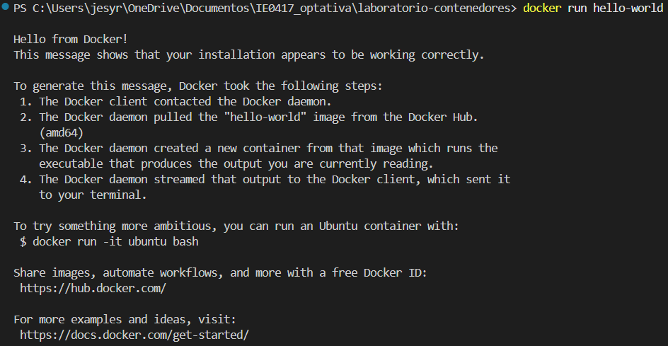
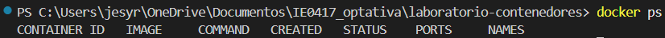
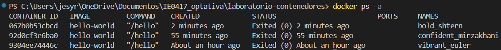

# Laboratorio 2 – Parte 2: Primer contenedor

## Nombre de la estudiante
Jesy Pricilla Rivera Duarte

## Objetivo

Ejecutar el primer contenedor utilizando una imagen existente descargada desde Docker Hub.

---

# Ejecución del contenedor hello-world

## Comando ejecutado

```powershell
docker run hello-world
```

## Explicación

Este comando descarga y ejecuta un contenedor basado en la imagen `hello-world`, que es una imagen oficial de Docker utilizada para verificar que Docker está funcionando correctamente.

## Resultado obtenido

```text
Hello from Docker!
This message shows that your installation appears to be working correctly.
```

El mensaje también explica internamente que ocurrió:

1. El cliente Docker se comunicó con el daemon de Docker.
2. Docker descargó la imagen `hello-world` desde Docker Hub
3. Se creó un contenedor basado en esa imagen
4. El contenedor ejecutó el programa interno y mostró el mensaje en la terminal.

## Evidencia



## Reflexión

Este primer ejercicio permitió comprobar que Docker funciona correctamente y que es capaz de descargar imágenes automáticamente desde Docker Hub y sirvió para ejecutar contenedores.

---

# Contenedores en ejecución

## Comando ejecutado

```powershell
docker ps
```

## Explicación

Este comando muestra únicamente los contenedores que se encuentran ejecutándose en el momento.

## Resultado obtenido

```text
CONTAINER ID   IMAGE     COMMAND   CREATED   STATUS    PORTS     NAMES
```

En este caso no apareció ningún contenedor en ejecución.

## Evidencia



## Reflexión

Este resultado muestra que el contenedor `hello-world` terminó su ejecución inmediatamente después de mostrar el mensaje en pantalla.

---

# Todos los contenedores

## Comando ejecutado

```powershell
docker ps -a
```

## Explicación

Este comando muestra todos los contenedores del sistema, incluye los que están detenidos.

## Resultado obtenido

```text
CONTAINER ID   IMAGE         COMMAND    STATUS
067b0b53cbcd   hello-world   "/hello"   Exited (0)
```

También aparecieron otros contenedores `hello-world` ejecutados anteriormente.

## Evidencia



## Diferencia entre docker ps y docker ps -a

- `docker ps` muestra únicamente los contenedores activos o en ejecución.
- `docker ps -a` muestra todos los contenedores, incluso los que ya finalizaron o los fueron detenidos.

## Reflexión

Me pareció interesante observar que los contenedores pueden existir aunque ya no estén ejecutándose. Entonces Docker mantiene el historial de los contenedores creados hasta que sean eliminados manualmente.

---

# Preguntas de reflexión

## 1. ¿Qué es la imagen hello-world?

La imagen `hello-world` es una imagen oficial de Docker que se utiliza para verificar que Docker está instalado y funcionando correctamente. Su objetivo es ejecutar un pequeño programa que imprime un mensaje de prueba.

---

## 2. ¿El contenedor quedó ejecutándose después de imprimir el mensaje?

No, el contenedor terminó su ejecución inmediatamente después de mostrar el mensaje, esto es porque la tarea que debía realizar ya había finalizado.

---

## 3. ¿Por qué aparece en docker ps -a pero no necesariamente en docker ps?

Porque `docker ps` solo muestra contenedores activos, mientras que `docker ps -a` también incluye los contenedores detenidos o finalizados.

---

## 4. ¿Qué demuestra este primer ejemplo sobre Docker?

Este ejemplo demuestra que Docker puede descargar imágenes automáticamente desde Docker Hub, crear contenedores a partir de ellas y ejecutarlas de manera rápida y sencilla.
