# Laboratorio 2 – Parte 3 y Parte 4

## Nombre de la estudiante
Jesy Pricilla Rivera Duarte

# Parte 3: Imágenes y contenedor

## Objetivo

Comprender la diferencia entre una imagen y un contenedor en Docker.

Una imagen puede verse como una plantilla que contiene todo lo necesario para ejecutar una aplicación, mientras que un contenedor es una instancia creada a partir de esa imagen.

---

# Descarga de la imagen Ubuntu

## Comando ejecutado

```powershell
docker pull ubuntu
```

## Explicación

Este comando descarga la imagen oficial de Ubuntu desde Docker Hub hacia el sistema local.

## Resultado obtenido

```text
Status: Downloaded newer image for ubuntu:latest
docker.io/library/ubuntu:latest
```

## Evidencia

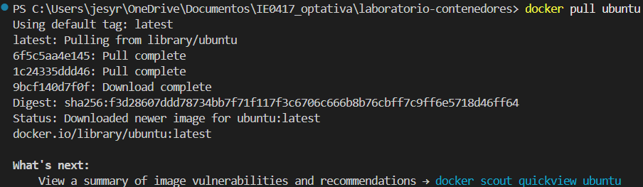

## ¿Qué hace docker pull?

El comando `docker pull` se utiliza para descargar imágenes desde un registro de Docker, normalmente Docker Hub. Si la imagen no existe localmente, Docker la descarga automáticamente.

## Reflexión

Este comando es importante porque permite obtener imágenes listas para usar sin necesidad de instalar manualmente sistemas operativos o aplicaciones.

---

# Lista de imágenes disponibles

## Comando ejecutado

```powershell
docker images
```

## Explicación

Este comando muestra todas las imágenes almacenadas localmente en Docker.

## Resultado obtenido

```text
IMAGE                ID             DISK USAGE
hello-world:latest   0e760fdfbc48
ubuntu:latest        f3d28607ddd7
```

## Evidencia

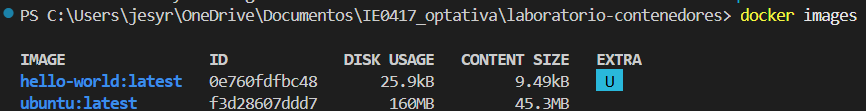

## ¿Qué muestra docker images?

Muestra información sobre las imágenes disponibles en el sistema, como:

- Nombre de la imagen.
- Etiqueta o versión.
- Identificador de la imagen.
- Tamaño utilizado en disco.

## Reflexión

Me pareció útil porque permite ver qué imágenes ya están disponibles localmente y cuáles pueden utilizarse para crear contenedores.

---

# Ejecución de un contenedor interactivo

## Comando ejecutado

```powershell
docker run -it ubuntu bash
```

## Explicación

Este comando crea y ejecuta un contenedor basado en la imagen Ubuntu en modo interactivo.

- `-i` permite mantener la entrada interactiva
- `-t` crea una terminal dentro del contenedor
- `bash` inicia una consola Bash dentro del contenedor

## Resultado obtenido

Dentro del contenedor se ejecutaron los siguientes comandos:

```bash
ls
pwd
cat /etc/os-release
```

Resultados observados:

```text
bin  boot  dev  etc  home  lib  lib64
```

```text
/
```

```text
PRETTY_NAME="Ubuntu 26.04 LTS"
```

## Evidencia

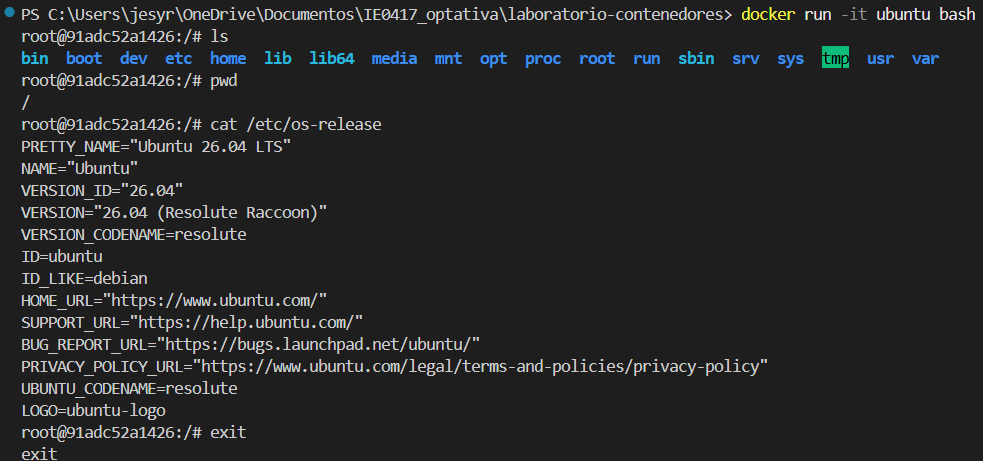

## ¿Qué significa ejecutar un contenedor en modo interactivo?

Significa que el usuario puede interactuar directamente con el contenedor mediante una terminal, ejecutando comandos como si estuviera dentro de un sistema Linux real.

## ¿Qué observé dentro del contenedor Ubuntu?

Dentro del contenedor se observó una estructura típica de Linux con carpetas como:

- `/bin`
- `/etc`
- `/home`
- `/usr`

También se pudo verificar la versión del sistema operativo Ubuntu usando el archivo `/etc/os-release`.

## ¿Qué ocurrió al salir del contenedor?

Al escribir `exit`, la terminal Bash terminó y el contenedor dejó de ejecutarse. Sin embargo, el contenedor no fue eliminado automáticamente.

## Reflexión

Fue interesante observar que el contenedor se comporta muy parecido a un sistema Linux real, aunque realmente no es una máquina virtual completa.

---

# Lista de contenedores

## Comando ejecutado

```powershell
docker ps -a
```

## Explicación

Este comando muestra todos los contenedores existentes, incluyendo los que ya fueron detenidos.

## Resultado obtenido

```text
CONTAINER ID   IMAGE         COMMAND
91adc52a1426   ubuntu        "bash"
067b0b53cbcd   hello-world   "/hello"
```

## Evidencia

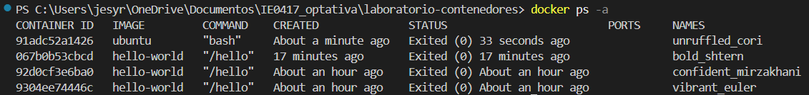

## Reflexión

Este comando permitió confirmar que el contenedor Ubuntu seguía existiendo aunque ya no estuviera ejecutándose.

---

# Preguntas de reflexión

## 1. ¿La imagen Ubuntu es lo mismo que una máquina virtual Ubuntu?

No, una imagen Ubuntu en Docker no es una máquina virtual completa. Es solamente una plantilla ligera con los archivos y programas necesarios para ejecutar Ubuntu dentro de un contenedor.

---

## 2. ¿Por qué el contenedor puede parecer un sistema Linux si no es una máquina virtual completa?

Porque el contenedor incluye el sistema de archivos y herramientas de Linux pero comparte el kernel del sistema host en lugar de ejecutar un sistema operativo completo independiente.

---

## 3. ¿Qué significa que el contenedor comparta el kernel con el host?

Significa que el contenedor utiliza el mismo kernel Linux que Docker ejecuta en el sistema host, en lugar de tener uno propio como ocurre en las máquinas virtuales.

---

## 4. ¿Qué diferencia hay entre una imagen descargada y un contenedor creado?

La imagen es una plantilla inmutable almacenada en el sistema, mientras que el contenedor es una instancia creada a partir de esa imagen y puede ejecutarse, detenerse o modificarse temporalmente.

# Administración de contenedores

## Objetivo

Aprender a crear, nombrar, iniciar, detener y eliminar contenedores en Docker.

---

# Creación de un contenedor con nombre

## Comando ejecutado

```powershell
docker run -it --name mi-ubuntu ubuntu bash
```

## Explicación

Este comando creó un contenedor basado en la imagen Ubuntu y abrió una terminal interactiva dentro del contenedor.

- `docker run` crea y ejecuta un contenedor
- `-it` permite interactuar con la terminal del contenedor
- `--name mi-ubuntu` asigna un nombre personalizado al contenedor
- `ubuntu` es la imagen utilizada
- `bash` inicia una consola Bash dentro del contenedor

## Resultado que se obtuvo

Dentro del contenedor se creó un archivo utilizando:

```bash
echo "Hola desde el contenedor" > mensaje.txt
```

Luego se verificó el contenido:

```bash
cat mensaje.txt
```

Resultado:

```text
Hola desde el contenedor
```

## Evidencia

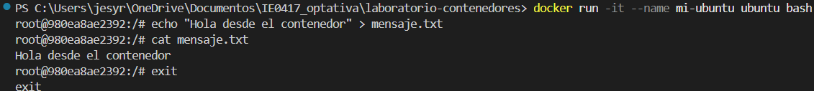

## Uso de --name

`--name` permite asignar un nombre fácil de recordar al contenedor. Esto ayuda a ejecutar comandos posteriormente sin tener que usar el ID completo del contenedor.

```powershell
docker start mi-ubuntu
docker stop mi-ubuntu
```

## Reflexión

Me pareció útil usar nombres personalizados porque eso hace más sencillo administrar los contenedores y recordar cuál es cada uno.

---

# Verificación del contenedor

## Comando ejecutado

```powershell
docker ps -a
```

## Explicación

Este comando muestra todos los contenedores del sistema, incluye los detenidos.

## Resultado

```text
980ea8ae2392   ubuntu   "bash"   Exited (0)   mi-ubuntu
```

## Evidencia

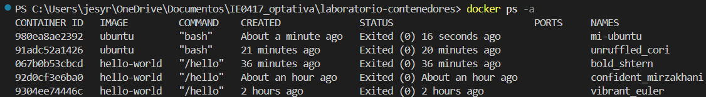

## Reflexión

Aquí pude comprobar que el contenedor seguía existiendo aunque ya no estuviera ejecutándose.

---

# Reinicio del contenedor

## Comando ejecutado

```powershell
docker start mi-ubuntu
```

## Explicación

Este comando inicia nuevamente un contenedor que ya existía y estaba detenido.

## Resultado

```text
mi-ubuntu
```

## Evidencia

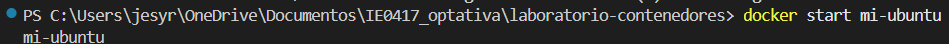

## Diferencia entre docker start y docker run

- `docker run` crea un contenedor nuevo y lo ejecuta.
- `docker start` solamente inicia un contenedor ya existente.

## Reflexión

Aprendí que no siempre es necesario crear un contenedor nuevo, también es posible reutilizar uno que ya existe.

---

# Ingreso nuevamente al contenedor

## Comando ejecutado

```powershell
docker exec -it mi-ubuntu bash
```

## Explicación

Este comando permite abrir una terminal dentro de un contenedor que ya está ejecutándose.

- `docker exec` ejecuta comandos dentro de un contenedor activo
- `-it` habilita la interacción con la terminal
- `bash` abre una consola Bash

## Resultado

Dentro del contenedor se verificó nuevamente el archivo:

```bash
cat mensaje.txt
```

Resultado:

```text
Hola desde el contenedor
```

## Evidencia

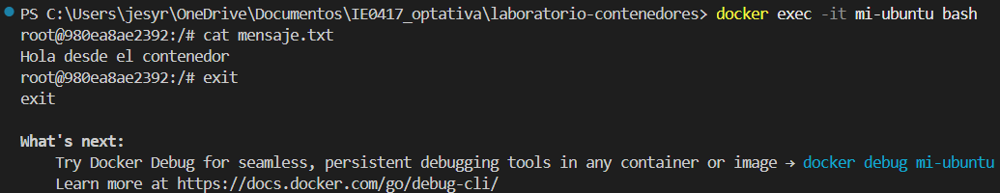

## Uso de docker exec

El comando `docker exec` sirve para ingresar a un contenedor en ejecución y ejecutar comandos dentro de él sin tener que crear otro contenedor.

## ¿Qué pasó con el archivo creado dentro del contenedor?

El archivo `mensaje.txt` seguía existiendo después de reiniciar el contenedor. Esto pasa porque el contenedor no había sido eliminado, solamente detenido.

## Reflexión

Me pareció interesante que el archivo se mantuviera incluso después de salir y volver a entrar al contenedor.

---

# Detención del contenedor

## Comando ejecutado

```powershell
docker stop mi-ubuntu
```

## Explicación

Este comando detiene un contenedor que se encuentra ejecutándose.

## Resultado

```text
mi-ubuntu
```

## Evidencia

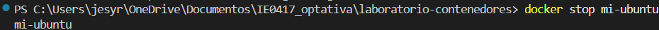

## Diferencia entre detener y eliminar un contenedor

- Detener un contenedor significa apagarlo temporalmente.
- Eliminar un contenedor significa borrarlo completamente del sistema.

## Reflexión

Entendí que detener un contenedor no elimina sus archivos ni configuración.

---

# Eliminación del contenedor

## Comando ejecutado

```powershell
docker rm mi-ubuntu
```

## Explicación

Este comando elimina completamente el contenedor del sistema.

## Resultado

```text
mi-ubuntu
```

## Evidencia

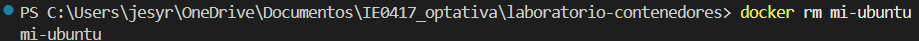

## Reflexión

Al eliminar el contenedor, toda la información almacenada dentro de él también desapareció.

---

# Verificación final

## Comando ejecutado

```powershell
docker ps -a
```

## Explicación

Se utilizó nuevamente este comando para verificar que el contenedor había sido eliminado correctamente.

## Resultado

El contenedor `mi-ubuntu` ya no aparecía en la lista.

## Evidencia

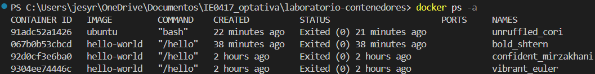

## Reflexión

Esta verificación permitió confirmar que el contenedor fue eliminado correctamente del sistema.

---

# Preguntas de reflexión

## 1. ¿Qué ventaja tiene asignar nombres a los contenedores?

Asignar nombres facilita la administración de los contenedores porque es más sencillo recordarlos y ejecutar comandos sobre ellos sin tener que copiar IDs largos.

---

## 2. ¿Qué diferencia hay entre crear un contenedor nuevo y reiniciar uno existente?

Crear un contenedor nuevo genera una instancia completamente nueva desde la imagen, mientras que reiniciar uno existente conserva los cambios y archivos que ya tenía el contenedor.

---

## 3. ¿Qué sucede con los datos creados dentro de un contenedor si este se elimina?

Los datos almacenados dentro del contenedor se eliminan junto con él, a menos de que se utilicen volúmenes o almacenamiento externo.

---

## 4. ¿Por qué se dice que los contenedores son desechables?

Porque pueden crearse, detenerse y eliminarse fácilmente sin afectar la imagen original. Es porque Docker está diseñado para que los contenedores puedan reemplazarse rápidamente cuando sea necesario.