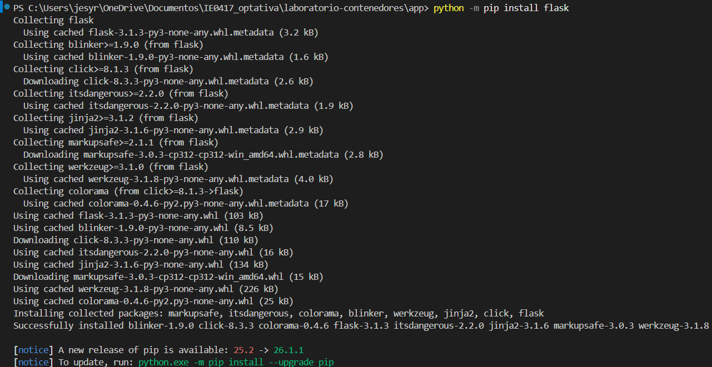
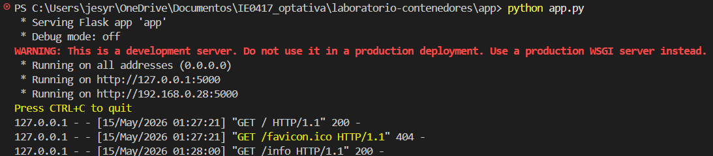
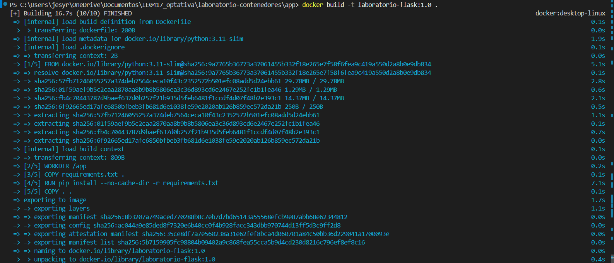
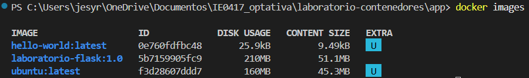
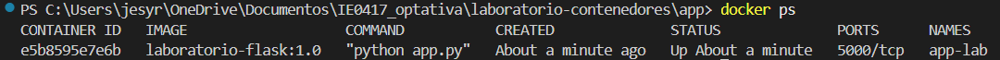
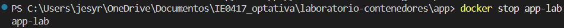
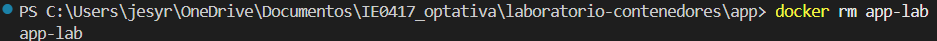

# Laboratorio 2

## Nombre de la estudiante
Jesy Pricilla Rivera Duarte

# Parte 5: Crear una aplicación sencilla

## Objetivo

El objetivo de esta parte fue crear una aplicación web básica utilizando Flask y ejecutarla localmente antes de usar Docker. También se buscó entender cómo funciona una aplicación web sencilla en Python y cómo se puede acceder desde el navegador.

---

# Creación de la aplicación Flask

Dentro de la carpeta `app/` se creó el archivo `app.py` con una aplicación sencilla usando Flask.

La aplicación tiene dos rutas:

- `/` muestra un mensaje HTML que indica que la aplicación se está ejecutando correctamente

- `/info` devuelve información en formato JSON sobre el laboratorio

También se creó el archivo `requirements.txt` con la dependencia necesaria:

```txt
flask
```

---

# Código utilizado

## app.py

```python
from flask import Flask
import os

app = Flask(__name__)

@app.route("/")
def home():
    mensaje = os.environ.get("MENSAJE", "Hola desde Flask en Docker")
    return f"""
    <h1>{mensaje}</h1>
    <p>Esta aplicación se está ejecutando dentro de un contenedor.</p>
    """

@app.route("/info")
def info():
    return {
        "app": "Laboratorio de contenedores",
        "curso": "IE0417",
        "tema": "Docker"
    }

if __name__ == "__main__":
    app.run(host="0.0.0.0", port=5000)
```

---

# Instalación de Flask

## Comando ejecutado

```powershell
python -m pip install flask
```

## Explicación

Con este comando se instala Flask. Flask es el framework que permite crear aplicaciones web sencillas.

## Resultado

La terminal mostró el mensaje:

```text
Successfully installed flask
```

## Evidencia



---

# Ejecución de la aplicación

## Comando ejecutado

```powershell
python app.py
```

## Explicación

Este comando ejecuta el archivo `app.py` y levanta la aplicación Flask en el puerto 5000.

## Resultado

La terminal mostró que la aplicación quedó ejecutándose correctamente y disponible en:

```text
http://127.0.0.1:5000
```

También se pudo acceder desde el navegador usando localhost.

## Evidencia



---

# Prueba en el navegador

## Dirección

```text
http://localhost:5000
```

## Resultado

La aplicación mostró el mensaje:

```text
Hola desde Flask en Docker
```

## Evidencia


---

# Explicación

La aplicación creada es una aplicación web sencilla usando Flask. Cuando el usuario entra a la ruta principal `/`, la aplicación muestra un mensaje HTML.

---

# Dependencia

La aplicación utiliza Flask como dependencia principal. Flask es un framework ligero de Python que facilita crear aplicaciones web de manera rápida y sencilla.

La dependencia fue guardada en el archivo:

```text
requirements.txt
```

---

# Uso de host="0.0.0.0"

En la aplicación se utilizó:

```python
app.run(host="0.0.0.0", port=5000)
```

Esto permite que la aplicación pueda recibir conexiones desde fuera del contenedor.

Si se utilizara solamente `localhost`, la aplicación solo aceptaría conexiones internas y no sería accesible desde Docker o desde otros dispositivos.

---

# Reflexión

Esta parte del laboratorio me ayudó a entender cómo crear una aplicación web sencilla usando Flask y cómo ejecutarla desde la terminal. También comprendí que es importante probar primero la aplicación localmente antes de ejecutarla dentro de Docker.

Además aprendí que Flask permite crear rutas fácilmente y que las variables de entorno ayudan a configurar la aplicación sin modificar el código.

---

# Preguntas de reflexión

## 1. ¿Qué hace Flask en esta aplicación?

Flask permite crear la aplicación web y definir las rutas que responden a las solicitudes del navegador. Flask posibilita el crear una página principal.

---

## 2. ¿Para qué sirve el archivo requirements.txt?

El archivo `requirements.txt` sirve para guardar las dependencias que necesita el ejercicio. En este caso se utilizó para indicar que la aplicación necesita Flask. Esto facilita instalar las mismas dependencias en otros ambientes o dentro de Docker.

---

## 3. ¿Por qué una aplicación dentro de un contenedor debe escuchar en 0.0.0.0?

Porque de esta forma acepta conexiones desde fuera del contenedor. Si se utilizara solamente `localhost`, la aplicación quedaría accesible únicamente dentro del mismo contenedor y no se podría abrir desde el navegador del host.

---

## 4. ¿Qué diferencia hay entre ejecutar la aplicación localmente y ejecutarla dentro de Docker?

Cuando se ejecuta localmente, la aplicación usa directamente el entorno de Python instalado en la computadora. En cambio, dentro de Docker la aplicación se ejecuta en un contenedor aislado que incluye sus propias dependencias y configuración.

---

# Parte 6: construir una imagen con Dockerfile

## Objetivo

En esta parte del laboratorio construí una imagen personalizada utilizando un Dockerfile. También ejecuté un contenedor a partir de esa imagen para entender mejor cómo Docker empaqueta y ejecuta aplicaciones.

---

# Dockerfile utilizado

```dockerfile
FROM python:3.11-slim

WORKDIR /app

COPY requirements.txt .

RUN pip install --no-cache-dir -r requirements.txt

COPY . .

EXPOSE 5000

CMD ["python", "app.py"]
```

---

# Explicación de cada instrucción del Dockerfile

## FROM

```dockerfile
FROM python:3.11-slim
```

Esta instrucción indica la imagen base que se va a utilizar. En este caso se usó una imagen oficial de Python versión 3.11 en su versión slim.

La imagen base ya trae Python instalado entonces no fue necesario instalarlo manualmente. La versión slim es una versión más ligera y pequeña, esto ayuda a que la imagen final ocupe menos espacio.

---

## WORKDIR

```dockerfile
WORKDIR /app
```

Esta instrucción define el directorio de trabajo dentro del contenedor. A partir de este punto, todos los comandos se ejecutan dentro de la carpeta `/app` y también ayuda a mantener el proyecto organizado dentro del contenedor.

---

## COPY

```dockerfile
COPY requirements.txt .
```

Este comando copia el archivo `requirements.txt` desde la computadora local hacia el contenedor.

Primero se copia únicamente este archivo para instalar las dependencias antes de copiar el resto del proyecto.

---

```dockerfile
COPY . .
```

Este comando copia todos los archivos del proyecto hacia el contenedor. Aquí se copió el archivo `app.py` y los demás archivos de la aplicación.

---

## RUN

```dockerfile
RUN pip install --no-cache-dir -r requirements.txt
```

Esta instrucción ejecuta un comando durante la construcción de la imagen. En este caso se instalaron las dependencias necesarias para la aplicación Flask utilizando el archivo `requirements.txt`.

La opción `--no-cache-dir` evita guardar archivos temporales innecesarios y ayuda a reducir el tamaño de la imagen.

---

## EXPOSE

```dockerfile
EXPOSE 5000
```

Esta instrucción indica que la aplicación utiliza el puerto 5000.

No abre el puerto automáticamente, pero sirve como documentación para indicar cuál puerto utiliza la aplicación dentro del contenedor.

---

## CMD

```dockerfile
CMD ["python", "app.py"]
```

Esta instrucción define el comando que se ejecutará automáticamente cuando el contenedor inicie. En este caso se ejecuta la aplicación Flask usando Python.

---

# Construcción de la imagen

Para construir la imagen ejecuté el siguiente comando:

```powershell
docker build -t laboratorio-flask:1.0 .
```

## Explicación

- `docker build` crea una imagen a partir del Dockerfile
- `-t` permite asignarle un nombre a la imagen
- `laboratorio-flask` es el nombre de la imagen
- `1.0` es la versión o tag de la imagen
- El punto `.` indica que Docker debe usar la carpeta actual como contexto de construcción

Durante el proceso Docker descargó la imagen base de Python, copió los archivos e instaló Flask automáticamente.

---

# Resultado de docker images

Después de construir la imagen ejecuté:

```powershell
docker images
```

Resultado observado:

```powershell
IMAGE                   ID             DISK USAGE   CONTENT SIZE
hello-world:latest      0e760fdfbc48       25.9kB
laboratorio-flask:1.0   5b7159905fc9        210MB
ubuntu:latest           f3d28607ddd7        160MB
```

## Explicación

Este comando muestra todas las imágenes descargadas o creadas en Docker.

Aparecieron:

- `hello-world`
- `ubuntu`
- `laboratorio-flask:1.0`

También muestra información como:

- ID de la imagen
- espacio utilizado
- tamaño
- nombre y versión

---

# Ejecución del contenedor

Para ejecutar el contenedor utilicé:

```powershell
docker run --name app-lab laboratorio-flask:1.0
```

## Explicación

- `docker run` crea y ejecuta un contenedor
- `--name app-lab` asigna un nombre al contenedor
- `laboratorio-flask:1.0` es la imagen utilizada

Al ejecutarlo, la aplicación Flask inició correctamente dentro del contenedor.

---

# Verificación del contenedor

En otra terminal ejecuté:

```powershell
docker ps
```

Resultado:

```powershell
CONTAINER ID   IMAGE                   COMMAND           STATUS
e5b8595e7e6b   laboratorio-flask:1.0   "python app.py"  Up About a minute
```

## Explicación

El comando `docker ps` muestra los contenedores que están actualmente en ejecución. Aquí pude verificar que el contenedor `app-lab` estaba activo.

---

# Detener y eliminar el contenedor

## Detener el contenedor

```powershell
docker stop app-lab
```

Este comando detuvo la ejecución del contenedor.

---

## Eliminar el contenedor

```powershell
docker rm app-lab
```

Este comando eliminó el contenedor del sistema. La imagen `laboratorio-flask:1.0` siguió existiendo aunque el contenedor fue eliminado.

---

# Diferencia entre nombre de imagen y nombre de contenedor

## Nombre de imagen

La imagen es la plantilla utilizada para crear contenedores.

En este caso:

```powershell
laboratorio-flask:1.0
```

- `laboratorio-flask` es el nombre
- `1.0` es la versión

---

## Nombre de contenedor

El contenedor es una instancia creada a partir de la imagen.

El nombre fue:

```powershell
app-lab
```

Pueden existir varios contenedores diferentes creados desde la misma imagen.

---

# Evidencias

## Construcción de la imagen



---

## Lista de imágenes



---

## Contenedor en ejecución



---

## Detener contenedor



---

## Eliminar contenedor



---

# Preguntas de reflexión

## 1. ¿Qué es una imagen base?

Una imagen base es la imagen inicial sobre la que se construye otra imagen. En este laboratorio se utilizó `python:3.11-slim`, que ya trae Python instalado y configurado.

---

## 2. ¿Por qué se usa una imagen slim?

Porque ocupa menos espacio y contiene únicamente lo necesario para ejecutar la aplicación, esto ayuda a que las imágenes sean más ligeras y rápidas de descargar.

---

## 3. ¿Por qué se copian primero las dependencias y luego el resto del código?

Porque Docker puede reutilizar la capa donde instala las dependencias si el archivo `requirements.txt` no cambia, esto hace que las futuras construcciones sean más rápidas.

---

## 4. ¿Qué diferencia hay entre RUN y CMD?

- `RUN` ejecuta comandos durante la construcción de la imagen.
- `CMD` ejecuta comandos cuando el contenedor inicia.

En este laboratorio:

- `RUN` instaló Flask.
- `CMD` ejecutó la aplicación Flask.

---

## 5. ¿Qué pasaría si se elimina la imagen pero no el Dockerfile?

El Dockerfile seguiría existiendo porque es solo un archivo de texto, entonces se podría volver a construir la imagen nuevamente usando:

```powershell
docker build -t laboratorio-flask:1.0 .
```