# Parte 7: publicación de puertos

## Objetivo

En esta parte del laboratorio aprendí cómo publicar los puertos de un contenedor para poder acceder a la aplicación desde el navegador de la computadora anfitriona.

---

# Ejecución del contenedor usando el puerto 5000

Primero ejecuté el siguiente comando:

```powershell
docker run --name app-puertos -p 5000:5000 laboratorio-flask:1.0
```

## Explicación

- `docker run` crea y ejecuta un contenedor
- `--name app-puertos` asigna un nombre al contenedor
- `-p 5000:5000` publica el puerto del contenedor
- `laboratorio-flask:1.0` es la imagen utilizada

Después de ejecutar el comando, la aplicación Flask inició correctamente dentro del contenedor.

---

# Significado de -p 5000:5000

```powershell
-p 5000:5000
```

Este parámetro conecta un puerto de la computadora anfitriona con un puerto del contenedor.

- El primer `5000` pertenece al host
- El segundo `5000` pertenece al contenedor

Esto significa que cuando se visita:

```text
http://localhost:5000
```

la solicitud entra por el puerto 5000 de la computadora y Docker la redirige al puerto 5000 del contenedor.

---

# Acceso desde el navegador

Después de publicar el puerto, abrí el navegador y accedí a:

```text
http://localhost:5000
```

La aplicación mostró correctamente el mensaje de Flask.

También probé la ruta:

```text
http://localhost:5000/info
```

En esta ruta se mostró información en formato JSON sobre la aplicación.

---

# Detener y eliminar el contenedor

## Detener el contenedor

```powershell
docker stop app-puertos
```

Este comando detuvo el contenedor en ejecución.

---

## Eliminar el contenedor

```powershell
docker rm app-puertos
```

Este comando eliminó el contenedor del sistema.

---

# Ejecución usando otro puerto del host

Después ejecuté nuevamente la aplicación utilizando otro puerto del host:

```powershell
docker run --name app-puertos-2 -p 8080:5000 laboratorio-flask:1.0
```

---

# Significado de -p 8080:5000

```powershell
-p 8080:5000
```

- El puerto `8080` pertenece al host
- El puerto `5000` pertenece al contenedor

Esto significa que la aplicación sigue funcionando dentro del contenedor en el puerto 5000, pero desde la computadora se accede usando el puerto 8080.

Por eso la aplicación se abrió desde:

```text
http://localhost:8080
```

---

# Diferencia entre puerto del host y puerto del contenedor

## Puerto del host

Es el puerto de la computadora host, es el puerto que se usa desde el navegador para acceder a la aplicación.

- 5000
- 8080

---

## Puerto del contenedor

Es el puerto interno donde la aplicación se está ejecutando dentro del contenedor, en este laboratorio la aplicación Flask utilizó siempre el puerto:

```text
5000
```

---

# Evidencias

## Ejecución del contenedor usando puerto 5000

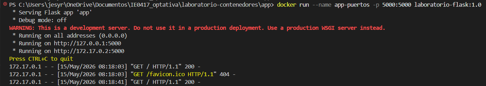

---

## Aplicación funcionando en localhost:5000

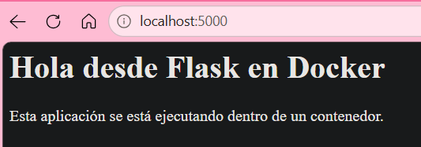

---

## Ruta /info funcionando

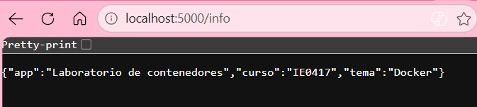

---

## Eliminación del contenedor app-puertos

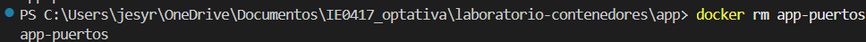

---

## Ejecución del contenedor usando puerto 8080

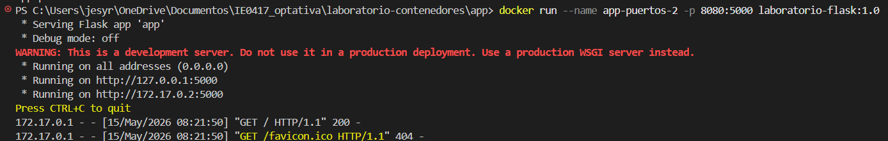

---

## Aplicación funcionando en localhost:8080

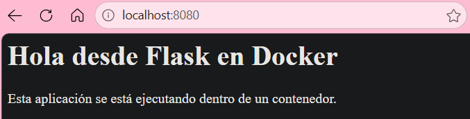

---

## Detención del contenedor app-puertos-2

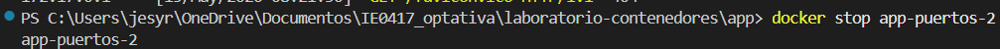

---

## Eliminación del contenedor app-puertos-2

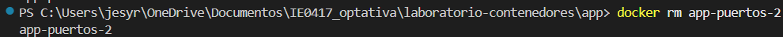

---

# Preguntas de reflexión

## 1. ¿Por qué no basta con que la aplicación escuche en el puerto 5000 dentro del contenedor?

Porque el contenedor está aislado del sistema host, aunque la aplicación funcione dentro del contenedor, no se puede acceder desde la computadora si el puerto no se publica. Por eso es necesario usar `-p` para conectar ambos puertos.

---

## 2. ¿Qué función cumple el mapeo de puertos?

El mapeo de puertos permite comunicar la computadora host con el contenedor, entonces Docker recibe las solicitudes en el puerto del host y las redirige hacia el puerto interno del contenedor.

---

## 3. ¿Cuál es la diferencia entre el puerto del host y el puerto del contenedor?

El puerto del host pertenece a la computadora host. El puerto del contenedor pertenece a la aplicación que corre dentro del contenedor y ambos se conectan usando el parámetro `-p`.

---

## 4. ¿Qué pasaría si dos contenedores intentan usar el mismo puerto del host?

Docker mostraría un error porque un puerto del host solamente puede ser utilizado por un contenedor al mismo tiempo.

O sea, no se podrían ejecutar dos contenedores usando:

```powershell
-p 5000:5000
```

simultáneamente.

En ese caso sería necesario usar puertos distintos en el host, como:

```powershell
-p 8080:5000
```

o

```powershell
-p 9000:5000
```

# Parte 8: logs e inspección de contenedores

## Objetivo

En esta parte del laboratorio aprendí a revisar información de un contenedor mientras está en ejecución. También aprendí a utilizar comandos para ver logs, inspeccionar configuraciones internas y monitorear el uso de recursos del contenedor.

---

# Ejecución del contenedor en segundo plano

Primero ejecuté el contenedor usando el parámetro `-d` que sirve para ejecutarlo en segundo plano.

```bash
docker run -d --name app-logs -p 5000:5000 laboratorio-flask:1.0
```

Resultado:

```bash
53128ca554fa1436dd81e89fd3f523ad5388d7097ba7c1df7bd9401502368cc6
```

Evidencia:

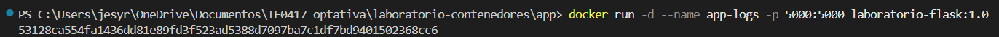

---

# Revisión de logs

Después utilicé el siguiente comando para ver los logs del contenedor:

```bash
docker logs app-logs
```

Resultado parcial:

```bash
 * Serving Flask app 'app'
 * Debug mode: off
 * Running on http://127.0.0.1:5000
 * Running on http://172.17.0.2:5000
```

Con este comando pude ver los mensajes que genera la aplicación mientras se ejecuta.

Evidencia:

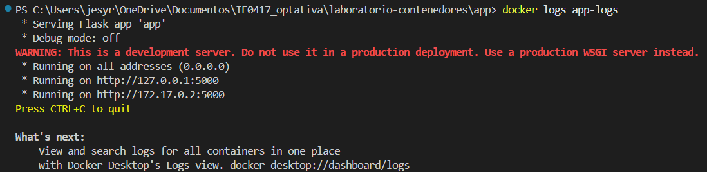

---

# Logs en tiempo real

Luego ejecuté:

```bash
docker logs -f app-logs
```

El parámetro `-f` significa "follow", esto permite seguir viendo los logs en tiempo real mientras el contenedor continúa funcionando. Cuando abrí la aplicación en el navegador, aparecieron nuevas líneas automáticamente en la terminal mostrando las solicitudes realizadas.

Evidencia:

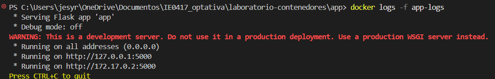

---

# Acceso desde el navegador

Después abrí las siguientes rutas en el navegador:

```text
http://localhost:5000
```

y:

```text
http://localhost:5000/info
```

La aplicación funcionó correctamente y mostró tanto la página principal como la información en formato JSON.

Evidencias:


---

# Inspección del contenedor

Después utilicé:

```bash
docker inspect app-logs
```

Este comando muestra información muy detallada del contenedor en formato JSON.

Entre la información que observé están:

- ID del contenedor
- Estado del contenedor
- Imagen utilizada
- Variables de entorno
- Configuración de red
- Dirección IP interna
- Puertos publicados
- Configuración de almacenamiento
- Comando ejecutado al iniciar

También pude observar que el contenedor estaba usando el puerto 5000 y que Docker le asignó una dirección IP interna.

Evidencias:

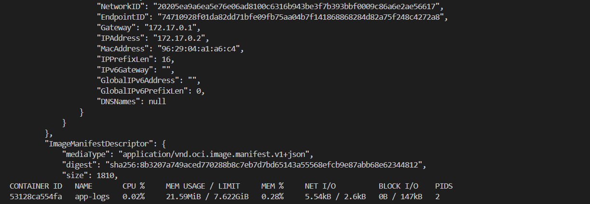

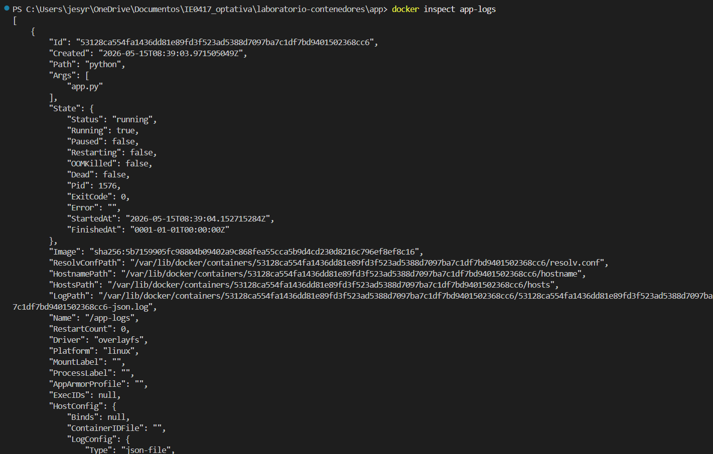

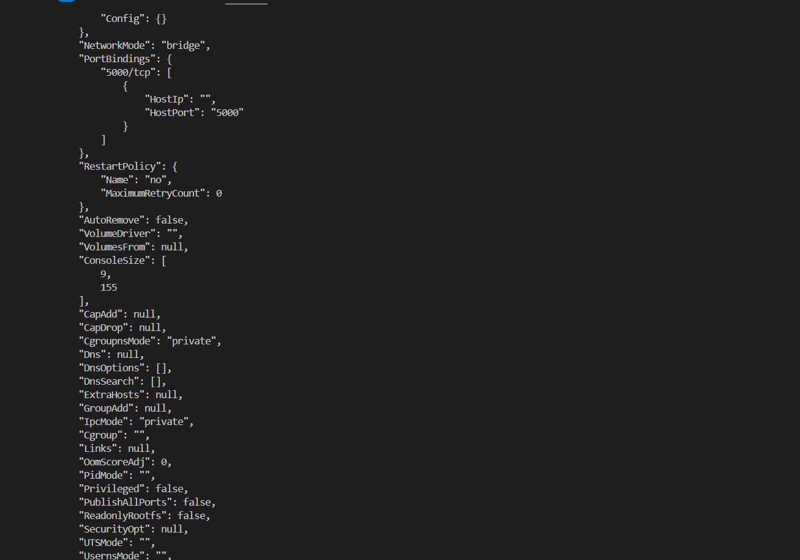

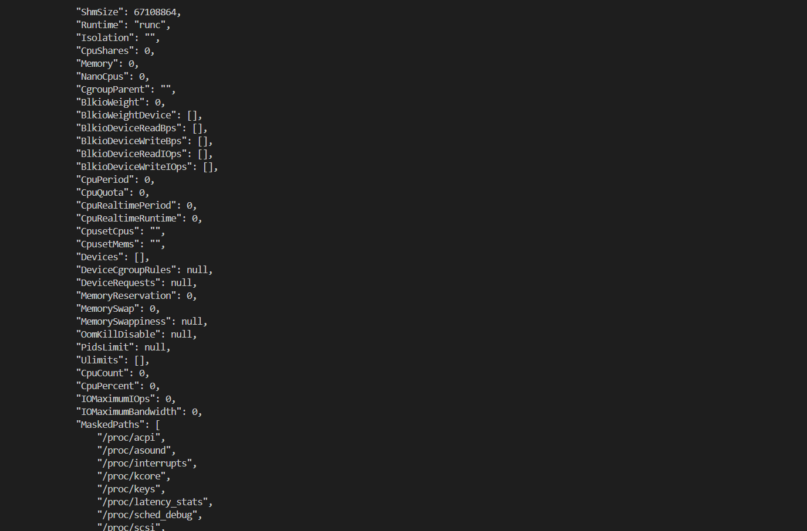

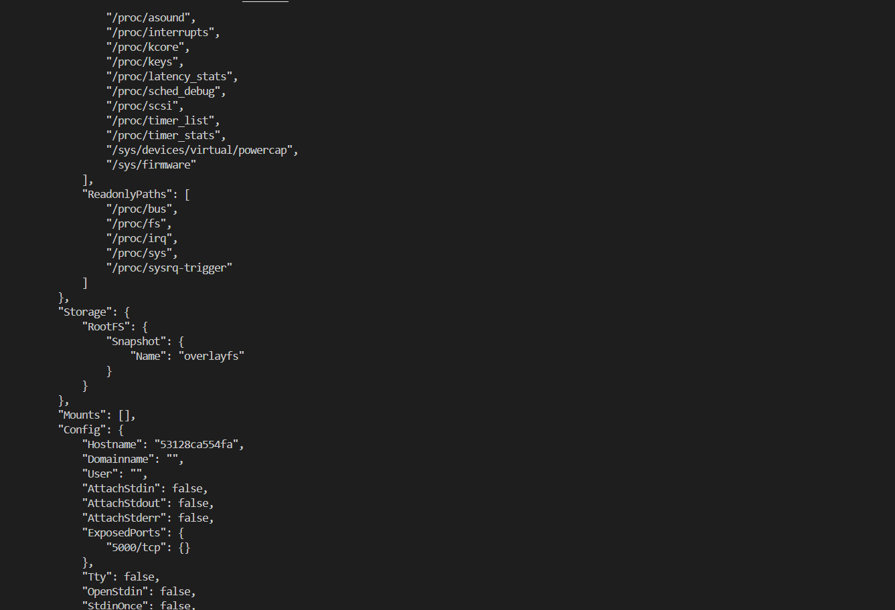

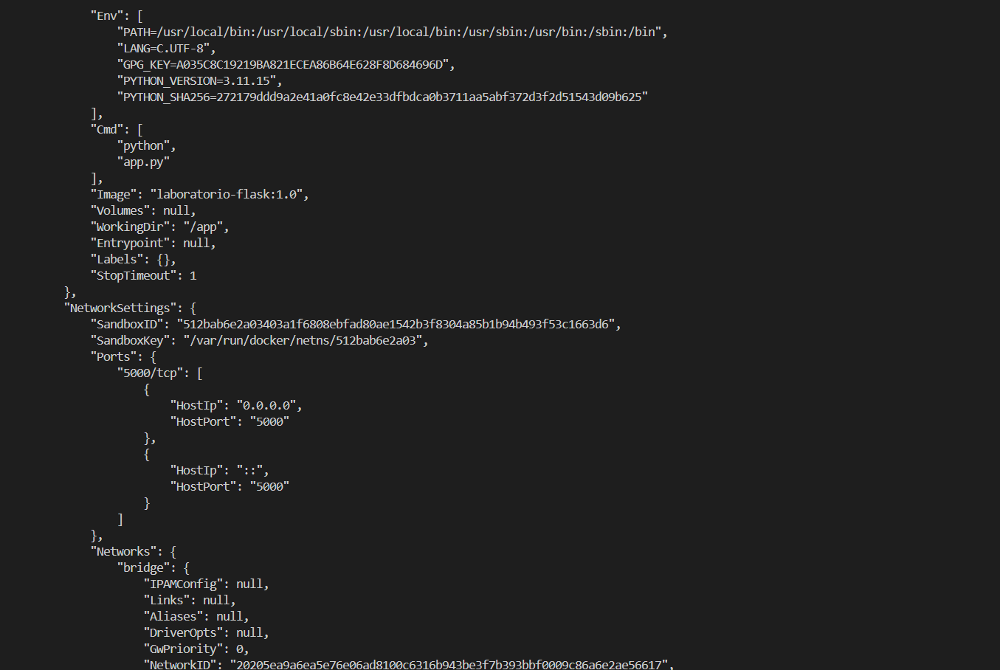

---

# Uso de recursos

Luego ejecuté:

```bash
docker stats
```

Este comando muestra información en tiempo real sobre el consumo de recursos del contenedor.

Pude observar:

- Uso de CPU
- Uso de memoria
- Tráfico de red
- Uso de disco
- Cantidad de procesos activos

Resultado parcial:

```bash
CONTAINER ID   NAME       CPU %     MEM USAGE / LIMIT
53128ca554fa   app-logs   0.02%     21.59MiB / 7.622GiB
```

Esto me permitió ver que el contenedor estaba consumiendo muy pocos recursos.

---

# Detener y eliminar el contenedor

Finalmente detuve y eliminé el contenedor.

```bash
docker stop app-logs
```

```bash
docker rm app-logs
```

Evidencias:

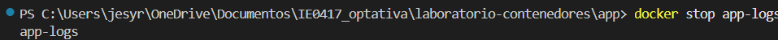

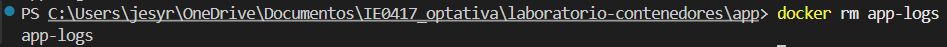

---

# Explicación de los comandos utilizados

## ¿Qué muestra docker logs?

El comando `docker logs` muestra los mensajes y salidas generadas por una aplicación dentro del contenedor. Sirve para revisar si la aplicación inició correctamente o si ocurrió algún error.

---

## ¿Para qué sirve docker logs -f?

El comando `docker logs -f` sirve para observar los logs en tiempo real. Mientras la aplicación sigue funcionando, los nuevos mensajes aparecen automáticamente en la terminal.

---

## ¿Qué tipo de información muestra docker inspect?

`docker inspect` muestra información muy detallada del contenedor, como:

- Estado actual
- Configuración de red
- Puertos
- Variables de entorno
- Imagen utilizada
- Dirección IP
- Configuración del sistema de archivos

Toda esta información aparece en formato JSON.

---

## ¿Qué información muestra docker stats?

`docker stats` muestra el consumo de recursos de los contenedores en tiempo real.

Por ejemplo:

- CPU
- Memoria RAM
- Red
- Disco
- Procesos activos

Esto ayuda a monitorear el rendimiento de los contenedores.

---

# Preguntas de reflexión

## 1. ¿Por qué los logs son importantes al trabajar con contenedores?

Los logs son importantes porque permiten ver qué está haciendo la aplicación dentro del contenedor. También ayudan a detectar errores, revisar mensajes del sistema y entender si la aplicación está funcionando correctamente.

---

## 2. ¿Qué diferencia hay entre ver logs históricos y logs en tiempo real?

Los logs históricos muestran mensajes que ya ocurrieron anteriormente. En cambio, los logs en tiempo real muestran nuevos mensajes conforme van ocurriendo mientras el contenedor sigue ejecutándose.

---

## 3. ¿Qué información útil se puede obtener con docker inspect?

Con `docker inspect` se puede obtener mucha información útil sobre el contenedor, por ejemplo:

- Estado actual
- Dirección IP
- Puertos
- Variables de entorno
- Configuración de red
- Imagen utilizada
- Configuración interna

---

## 4. ¿Por qué es importante observar el consumo de recursos?

Es importante porque permite verificar si el contenedor está utilizando demasiada memoria o CPU, esto ayuda a detectar problemas de rendimiento y a asegurarse de que la aplicación funcione correctamente sin consumir recursos innecesarios.

# Parte 9: variables de entorno

## Objetivo

En esta parte del laboratorio aprendí a utilizar variables de entorno para cambiar el comportamiento de una aplicación dentro de un contenedor sin necesidad de modificar el código ni reconstruir la imagen.

---

# Primera ejecución con variable de entorno

Primero ejecuté el contenedor utilizando la opción `-e` para definir una variable de entorno llamada `MENSAJE`.

```bash
docker run --name app-env -p 5000:5000 -e MENSAJE="Hola desde una variable de entorno" laboratorio-flask:1.0
```

Resultado:

```bash
 * Serving Flask app 'app'
 * Running on http://127.0.0.1:5000
 * Running on http://172.17.0.2:5000
```

La aplicación inició correctamente y el mensaje mostrado en la página principal cambió según el valor de la variable de entorno.

Evidencia:

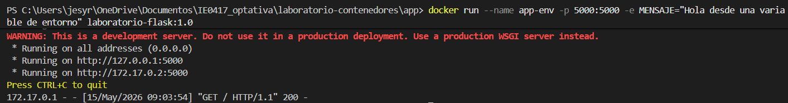

---

# Resultado en el navegador

Después abrí:

```text
http://localhost:5000
```

En la página apareció el mensaje:

```text
Hola desde una variable de entorno
```

Esto demostró que la aplicación estaba leyendo correctamente la variable de entorno configurada desde Docker.

Evidencia:


---

# Detener y eliminar el contenedor

Luego detuve y eliminé el contenedor.

```bash
docker stop app-env
```

```bash
docker rm app-env
```

Evidencias:

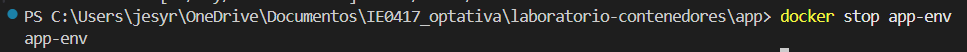

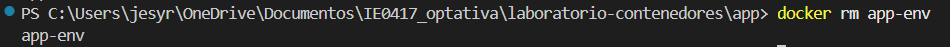

---

# Segunda ejecución con otra configuración

Después ejecuté nuevamente la aplicación, pero utilizando un mensaje diferente.

```bash
docker run --name app-env-2 -p 5000:5000 -e MENSAJE="Configuración cambiada sin modificar la imagen" laboratorio-flask:1.0
```

Resultado:

```bash
 * Serving Flask app 'app'
 * Running on http://127.0.0.1:5000
 * Running on http://172.17.0.2:5000
```

Esta vez el contenido mostrado por la aplicación cambió nuevamente aunque seguía usando exactamente la misma imagen Docker.

Evidencia:

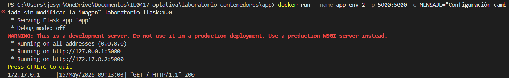

---

# Resultado de la segunda configuración

Abrí nuevamente:

```text
http://localhost:5000
```

Ahora la aplicación mostraba:

```text
Configuración cambiada sin modificar la imagen
```

Esto confirmó que las variables de entorno permiten modificar configuraciones sin cambiar el código fuente.

Evidencia:


---

# Explicación de las variables de entorno

## ¿Qué hace la opción -e?

La opción `-e` sirve para crear variables de entorno dentro del contenedor.

En este caso se utilizó:

```bash
-e MENSAJE="Hola desde una variable de entorno"
```

Esto hizo que la aplicación recibiera un valor diferente para mostrar en la página principal.

---

## ¿Qué cambió en la aplicación?

Lo único que cambió fue el mensaje mostrado en pantalla, la aplicación seguía siendo exactamente la misma pero el texto mostrado dependía del valor de la variable de entorno `MENSAJE`.

---

## ¿Por qué no fue necesario reconstruir la imagen?

No fue necesario reconstruir la imagen porque las variables de entorno permiten cambiar configuraciones al momento de ejecutar el contenedor. La imagen ya contenía toda la aplicación, solamente se modificó el valor de configuración enviado desde Docker.

---

# Preguntas de reflexión

## 1. ¿Por qué es útil configurar aplicaciones mediante variables de entorno?

Es útil porque permite cambiar configuraciones sin modificar el código fuente, esto hace facil reutilizar la misma aplicación en diferentes entornos o situaciones.

---

## 2. ¿Qué tipo de información podría configurarse así?

Se pueden configurar muchas cosas, como:

- Mensajes personalizados
- Puertos
- Direcciones IP
- Usuarios
- Contraseñas
- Claves de acceso
- Configuración de bases de datos
- Modo de ejecución de la aplicación

---

## 3. ¿Por qué no es buena práctica guardar contraseñas directamente dentro del código?

Porque el código puede compartirse o subirse a repositorios, si las contraseñas quedan escritas directamente ahí, otras personas pueden verlas y acceder a información sensible o personal. Entonces por seguridad es mejor usar variables de entorno.

---

## 4. ¿Qué ventaja tiene usar la misma imagen con diferentes configuraciones?

La ventaja es que se puede reutilizar la misma imagen en muchos entornos distintos sin necesidad de crear imágenes nuevas.

