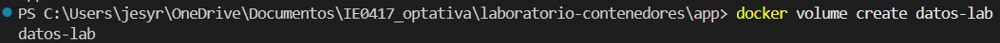
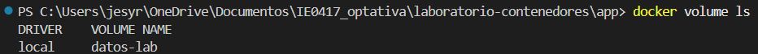
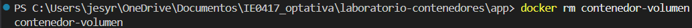
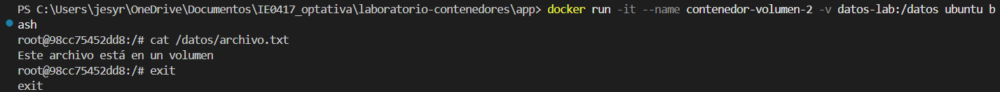
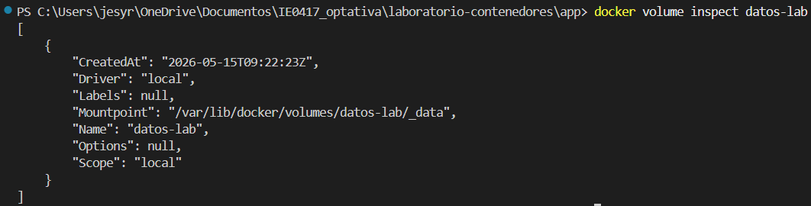
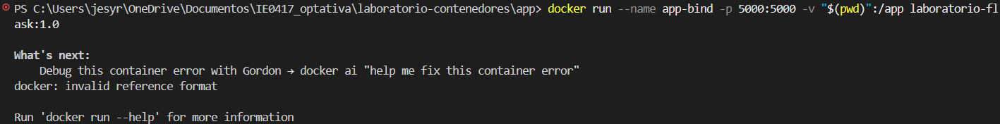
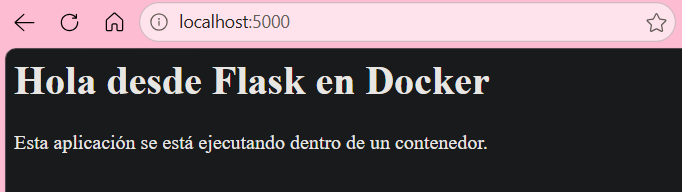
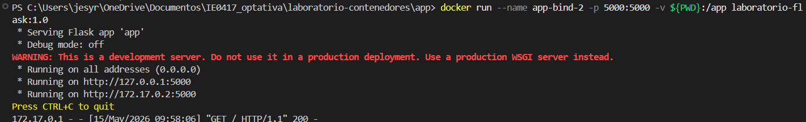
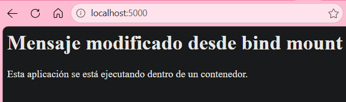

# Parte 10: persistencia con volúmenes

## Objetivo

Comprender por qué los datos dentro de un contenedor pueden perderse y cómo los volúmenes
permiten persistir información.

En la presentación se explica que, por defecto, los datos dentro de un contenedor se pierden al
eliminarlo, y que los volúmenes permiten persistir datos fuera del ciclo de vida del contenedor.


En esta parte del laboratorio aprendí cómo funcionan los volúmenes en Docker y por qué son importantes para guardar información de manera persistente. También pude comprobar que los datos almacenados dentro de un volumen no se pierden aunque el contenedor sea eliminado.

---

# Creación del volumen

Primero creé un volumen llamado `datos-lab` con el siguiente comando:

```bash
docker volume create datos-lab
```

Resultado:

```bash
datos-lab
```

Evidencia:



---

# Listado de volúmenes

Después verifiqué los volúmenes disponibles usando:

```bash
docker volume ls
```

Resultado:

```bash
DRIVER    VOLUME NAME
local     datos-lab
```

Este comando muestra todos los volúmenes creados en Docker.

Evidencia:



---

# Uso del volumen en un contenedor

Luego ejecuté un contenedor Ubuntu montando el volumen `datos-lab` en la carpeta `/datos` del contenedor.

Comando utilizado:

```bash
docker run -it --name contenedor-volumen -v datos-lab:/datos ubuntu bash
```

Dentro del contenedor ejecuté:

```bash
echo "Este archivo está en un volumen" > /datos/archivo.txt
```

Después verifiqué el contenido:

```bash
cat /datos/archivo.txt
```

Resultado:

```bash
Este archivo está en un volumen
```

Con esto comprobé que el archivo fue guardado dentro del volumen y no solamente dentro del contenedor.

---

# Eliminación del primer contenedor

Después salí del contenedor usando:

```bash
exit
```

Y eliminé el contenedor:

```bash
docker rm contenedor-volumen
```

Aunque el contenedor fue eliminado, el volumen siguió existiendo.

Evidencia:



---

# Verificación de persistencia de datos

Luego creé un nuevo contenedor utilizando el mismo volumen:

```bash
docker run -it --name contenedor-volumen-2 -v datos-lab:/datos ubuntu bash
```

Dentro del nuevo contenedor ejecuté:

```bash
cat /datos/archivo.txt
```

Resultado:

```bash
Este archivo está en un volumen
```

Esto demostró que el archivo seguía existiendo aunque el primer contenedor ya había sido eliminado.

Evidencia:



---

# Inspección del volumen

Finalmente inspeccioné el volumen usando:

```bash
docker volume inspect datos-lab
```

Resultado parcial:

```bash
[
    {
        "CreatedAt": "2026-05-15T09:22:23Z",
        "Driver": "local",
        "Mountpoint": "/var/lib/docker/volumes/datos-lab/_data",
        "Name": "datos-lab",
        "Scope": "local"
    }
]
```

Este comando muestra información detallada del volumen, como:

- Fecha de creación
- Nombre del volumen
- Driver utilizado
- Ruta donde Docker guarda físicamente los datos
- Alcance del volumen

Evidencia:



---

# Explicaciones

## ¿Qué es un volumen?

Un volumen es un espacio de almacenamiento administrado por Docker que sirve para guardar datos de forma persistente. Los datos almacenados en un volumen no se eliminan automáticamente cuando un contenedor desaparece.

---

## ¿Cómo se crea un volumen?

Se crea utilizando el comando:

```bash
docker volume create nombre-del-volumen
```

y en este laboratorio el volumen creado fue:

```bash
docker volume create datos-lab
```

---

## ¿Cómo se monta un volumen en un contenedor?

Se utiliza la opción `-v` al ejecutar el contenedor.

```bash
-v datos-lab:/datos
```

Esto significa:

- `datos-lab` nombre del volumen
- `/datos` carpeta dentro del contenedor donde se monta el volumen

---

## ¿Qué pasó con el archivo después de eliminar el primer contenedor?

El archivo siguió existiendo porque estaba guardado dentro del volumen y no dentro del contenedor. Cuando creé otro contenedor usando el mismo volumen, el archivo todavía estaba disponible.

---

# Preguntas de reflexión

## 1. ¿Qué problema resuelven los volúmenes?

Los volúmenes resuelven el problema de la pérdida de datos cuando un contenedor se elimina. Permiten guardar información de forma persistente aunque los contenedores desaparezcan.

---

## 2. ¿El volumen pertenece a un contenedor específico?

No, un volumen es independiente de los contenedores, varios contenedores pueden utilizar el mismo volumen al mismo tiempo.

---

## 3. ¿Qué diferencia hay entre eliminar un contenedor y eliminar un volumen?

Eliminar un contenedor solamente borra el contenedor y su entorno de ejecución.  
Eliminar un volumen borra los datos almacenados permanentemente dentro de ese volumen.

---

## 4. ¿Para qué casos reales se usarían volúmenes?

Los volúmenes se usan en muchos casos reales, como:

- Bases de datos
- Archivos de usuarios
- Configuraciones.
- Logs.
- Aplicaciones web que guardan información.
- Respaldos y almacenamiento persistente

Sin volúmenes, toda esa información se perdería al eliminar los contenedores.


# Parte 11: bind mounts

## Objetivo

Comprender la diferencia entre un volumen administrado por Docker y montar una carpeta local dentro de un contenedor.


En esta parte del laboratorio aprendí la diferencia entre usar un volumen administrado por Docker y montar directamente una carpeta local dentro de un contenedor usando bind mounts.

También pude comprobar que los cambios realizados en los archivos de mi computadora se reflejan dentro del contenedor sin necesidad de reconstruir la imagen.

---

# Ejecución del contenedor con bind mount

Primero intenté ejecutar el contenedor usando el comando indicado en la guía:

```bash
docker run --name app-bind -p 5000:5000 -v "$(pwd)":/app laboratorio-flask:1.0
```

Sin embargo, en PowerShell apareció el siguiente error:

```bash
docker: invalid reference format
```

Esto ocurrió porque la sintaxis `$(pwd)` funciona normalmente en Linux, pero en Windows PowerShell es necesario usar `${PWD}`.

Después ejecuté el comando correcto:

```powershell
docker run --name app-bind -p 5000:5000 -v ${PWD}:/app laboratorio-flask:1.0
```

Resultado:

```bash
 * Serving Flask app 'app'
 * Debug mode: off
 * Running on all addresses (0.0.0.0)
 * Running on http://127.0.0.1:5000
 * Running on http://172.17.0.2:5000
```

Con esto la aplicación se ejecutó correctamente.

Evidencia:



---

# Verificación en el navegador

Después abrí:

```text
http://localhost:5000
```

La aplicación mostró el mensaje original de Flask funcionando correctamente.

Evidencia:



---

# Modificación del archivo local

Luego modifiqué el archivo `app.py`, cambié el mensaje principal de la aplicación para comprobar si el contenedor reflejaba automáticamente los cambios realizados en el host.

No fue necesario reconstruir la imagen con `docker build`.

---

# Detener y eliminar el primer contenedor

Después detuve y eliminé el contenedor:

```bash
docker stop app-bind
docker rm app-bind
```

Resultado:

```bash
app-bind
app-bind
```

---

# Segunda ejecución del contenedor

Luego ejecuté nuevamente el contenedor usando bind mount:

```powershell
docker run --name app-bind-2 -p 5000:5000 -v ${PWD}:/app laboratorio-flask:1.0
```

Resultado:

```bash
 * Serving Flask app 'app'
 * Debug mode: off
 * Running on all addresses (0.0.0.0)
 * Running on http://127.0.0.1:5000
 * Running on http://172.17.0.2:5000
```

Evidencia:



---

# Verificación del cambio

Abrí nuevamente:

```text
http://localhost:5000
```

Esta vez la aplicación mostró el mensaje modificado que había cambiado en el archivo `app.py`, esto demostró que el contenedor estaba utilizando directamente los archivos de mi computadora gracias al bind mount.

Evidencia:



---

# Finalización del contenedor

Finalmente detuve y eliminé el contenedor:

```bash
docker stop app-bind-2
docker rm app-bind-2
```

Resultado:

```bash
app-bind-2
app-bind-2
```

---

# Explicaciones

## ¿Qué diferencia hay entre `datos-lab:/datos` y `"$(pwd)":/app`?

### `datos-lab:/datos`

Este es un volumen administrado por Docker.

- `datos-lab` es el nombre del volumen
- Docker guarda los datos internamente
- Los archivos permanecen aunque los contenedores se eliminen

```bash
-v datos-lab:/datos
```

---

### `"$(pwd)":/app` o `${PWD}:/app`

Esto es un bind mount.

- Se monta una carpeta real de la computadora host
- El contenedor utiliza directamente esos archivos
- Los cambios realizados en la carpeta local aparecen dentro del contenedor

```powershell
-v ${PWD}:/app
```

---

## ¿Qué ocurrió al modificar el código local?

Cuando modifiqué el archivo `app.py` en mi computadora, el cambio apareció dentro del contenedor al volver a ejecutarlo. No fue necesario reconstruir la imagen porque el contenedor estaba leyendo directamente los archivos del host.

---

## ¿Por qué esto puede ser útil durante el desarrollo?

Esto es útil porque permite modificar el código rápidamente sin crear una imagen nueva cada vez. La persona que programa puede editar archivos en VS Code y probar cambios inmediatamente en el contenedor. Esto ahorra mucho tiempo durante el desarrollo de aplicaciones.

---

# Preguntas de reflexión

## 1. ¿Qué diferencia hay entre un volumen y un bind mount?

Un volumen es administrado completamente por Docker y sirve principalmente para guardar datos persistentes.

Un bind mount conecta directamente una carpeta de la computadora host con una carpeta dentro del contenedor.

---

## 2. ¿Cuál parece más conveniente para desarrollo?

El bind mount parece más conveniente para desarrollo porque permite modificar archivos localmente y ver los cambios rápidamente dentro del contenedor.

---

## 3. ¿Cuál parece más conveniente para datos persistentes de una aplicación?

Los volúmenes parecen más convenientes para datos persistentes porque Docker los administra de forma más segura y organizada.

---

## 4. ¿Qué riesgos podría tener montar carpetas del host dentro del contenedor?

Puede haber riesgos de seguridad porque el contenedor tiene acceso directo a archivos de la computadora host, también se pueden modificar o borrar archivos importantes accidentalmente si no se tiene cuidado.

