# Parte 12: Redes de Docker

## Objetivos

- Crear una red personalizada en Docker.
- Conectar contenedores a una misma red.
- Permitir la comunicación entre contenedores usando nombres.
- Comprender cómo funciona la comunicación interna entre contenedores.

---

# Creación de una red Docker

Primero creé una red personalizada llamada `red-lab` usando el siguiente comando:

```bash
docker network create red-lab
```


Resultado:

```bash
181c9058fe6ee914e613dc7ca6ce88a06235b5206bebcd032da7bd1bc39d7294
```


---

# Listado de redes

Después verifiqué las redes disponibles con:

```bash
docker network ls
```

Resultado:

```bash
NETWORK ID     NAME      DRIVER    SCOPE
20205ea9a6ea   bridge    bridge    local
b2bcd12d144b   host      host      local
4faaf036a723   none      null      local
181c9058fe6e   red-lab   bridge    local
```

Aquí pude observar que la nueva red `red-lab` fue creada correctamente.

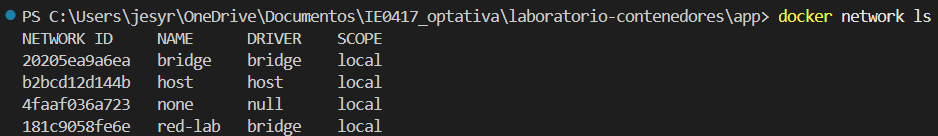

---

# Ejecución del contenedor Nginx

Luego ejecuté un contenedor con Nginx conectado a la red `red-lab`:

```bash
docker run -d --name servidor-web --network red-lab nginx
```

Docker descargó automáticamente la imagen de Nginx porque no estaba instalada localmente.

Resultado:

```bash
Unable to find image 'nginx:latest' locally
latest: Pulling from library/nginx
...
Status: Downloaded newer image for nginx:latest
```

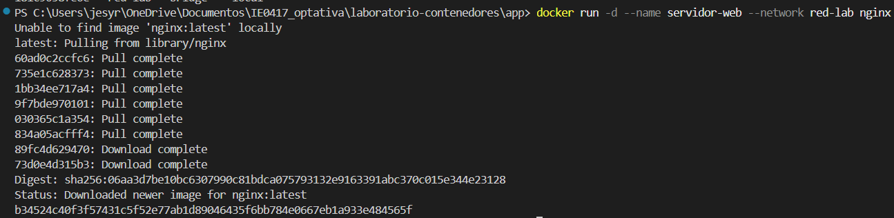

---

# Ejecución del contenedor cliente

Después ejecuté otro contenedor Ubuntu conectado a la misma red:

```bash
docker run -it --name cliente --network red-lab ubuntu bash
```

Durante esta parte ingresé al contenedor Ubuntu y preparé el entorno para realizar pruebas de conexión.

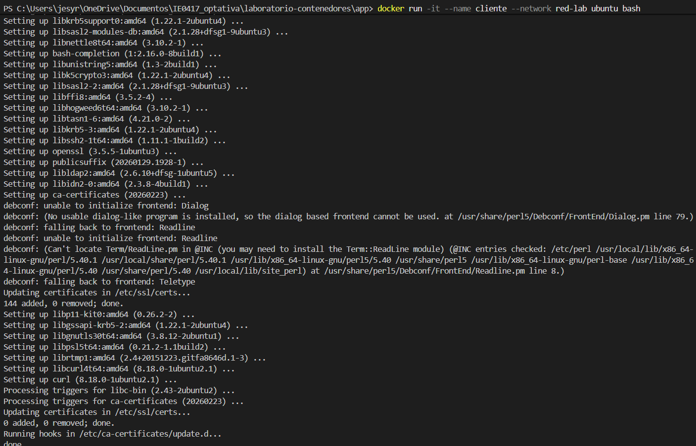

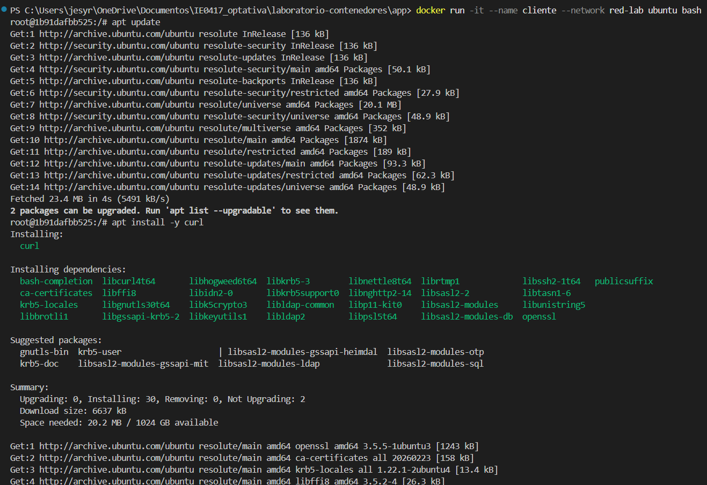

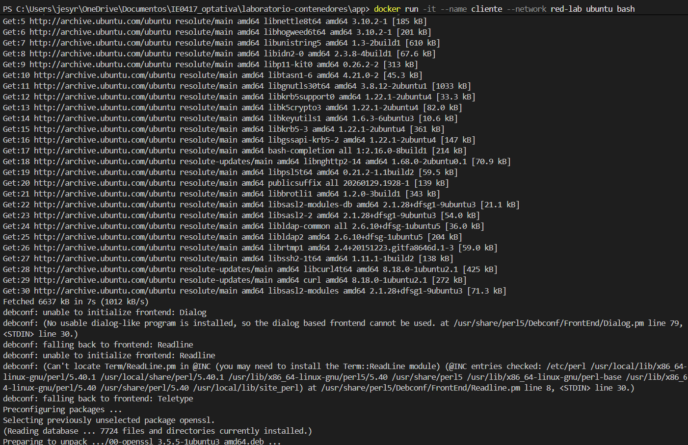

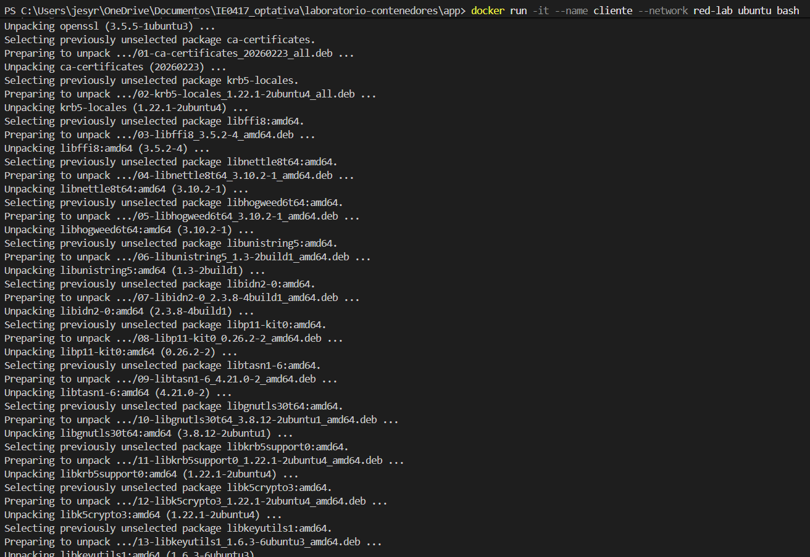

---

# Instalación de curl

Dentro del contenedor Ubuntu instalé `curl` para poder probar la conexión con el servidor web.

Primero actualicé los paquetes:

```bash
apt update
```

Luego instalé curl:

```bash
apt install -y curl
```

Esto permitió que el contenedor cliente pudiera hacer solicitudes HTTP.

---

# Comunicación entre contenedores

Después probé la conexión hacia el contenedor `servidor-web` usando:

```bash
curl http://servidor-web
```

Resultado:

```html
<!DOCTYPE html>
<html>
<head>
<title>Welcome to nginx!</title>
...
<h1>Welcome to nginx!</h1>
...
</html>
```

Esto demuestra que el contenedor cliente logró comunicarse correctamente con el contenedor Nginx.

Lo más importante es que no fue necesario usar una dirección IP. Docker resolvió automáticamente el nombre `servidor-web` porque ambos contenedores estaban conectados a la misma red.

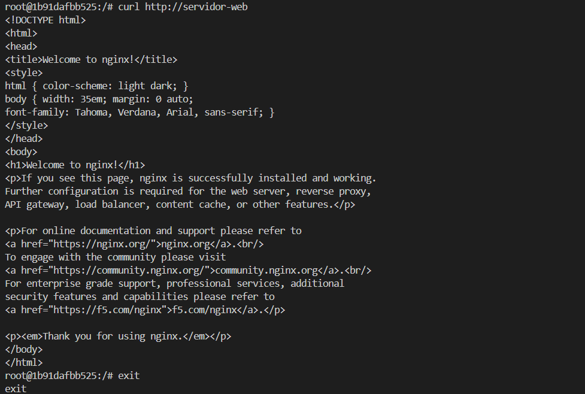

---

# Eliminación de contenedores

Después salí del contenedor Ubuntu usando:

```bash
exit
```

Luego detuve y eliminé los contenedores:

```bash
docker stop servidor-web
docker rm servidor-web
docker rm cliente
```

Resultados:

```bash
servidor-web
cliente
```

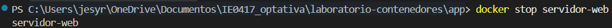

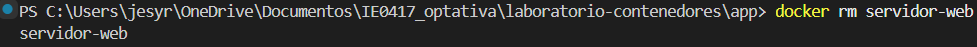


---

# Eliminación de la red

Finalmente eliminé la red creada:

```bash
docker network rm red-lab
```

Resultado:

```bash
red-lab
```

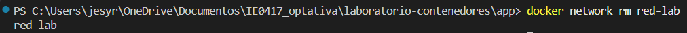

---

# Explicación

## ¿Qué es una red en Docker?

Una red en Docker permite que varios contenedores puedan comunicarse entre sí de manera segura y organizada. Cada contenedor puede enviar y recibir información usando la red a la que pertenece.

---

## ¿Qué hace `docker network create`?

Este comando crea una red personalizada en Docker. Esa red sirve para conectar contenedores y permitir que se comuniquen entre ellos.

---

## ¿Qué significa conectar contenedores a la misma red?

Significa que ambos contenedores pueden intercambiar información directamente. Docker permite usar el nombre del contenedor como si fuera un nombre de host dentro de la red.

---

## ¿Qué ocurrió al ejecutar `curl http://servidor-web`?

El contenedor Ubuntu logró conectarse al contenedor Nginx y recibió la página web de bienvenida, esto confirmó que ambos contenedores estaban comunicándose correctamente.

---

## ¿Por qué se pudo usar el nombre `servidor-web`?

Porque Docker tiene un sistema interno de resolución de nombres dentro de las redes personalizadas. Cuando un contenedor intenta acceder a otro usando su nombre, Docker automáticamente encuentra la dirección correcta.

---

# Preguntas de reflexión

## 1. ¿Por qué los contenedores necesitan redes?

Porque muchas aplicaciones necesitan comunicarse entre sí. O sea un servidor web puede necesitar conectarse con una base de datos o con otro servicio, las redes permiten esa comunicación.

---

## 2. ¿Qué ventaja tiene usar nombres de contenedor en lugar de direcciones IP?

Es más sencillo y más práctico. Las direcciones IP pueden cambiar, pero el nombre del contenedor se mantiene igual, eso hace que la configuración sea más fácil y más estable.

---

## 3. ¿Qué diferencia hay entre publicar un puerto hacia el host y comunicarse dentro de una red Docker?

Publicar un puerto permite que la máquina host acceda al contenedor desde afuera.

En cambio, la comunicación dentro de una red Docker ocurre directamente entre contenedores sin necesidad de exponer puertos al host.

---

## 4. ¿Qué ejemplos reales podrían usar una red Docker?

- Un servidor web conectado a una base de datos
- Una aplicación backend conectada a Redis
- Microservicios que necesitan comunicarse entre sí.
- Aplicaciones con frontend y backend separados

---
# Parte 13: Ejemplo con aplicación y base de datos simulada

## Objetivos

- Crear una red personalizada en Docker.
- Comunicar contenedores usando una misma red.
- Probar conexión entre servicios usando nombres de contenedores.
- Entender cómo una aplicación puede comunicarse con una base de datos.

---

# Creación de una red Docker

Primero creé una red personalizada llamada `red-app` con el siguiente comando:

```bash
docker network create red-app
```

Resultado:

```powershell
PS C:\Users\jesyr\OneDrive\Documentos\IE0417_optativa\laboratorio-contenedores\app> docker network create red-app
b3795cebf45bf8d595a00426adc8a91b0de6ec0f328386503b72285865d9c40d
```

Imagen:


Con este comando Docker creó una red personalizada donde los contenedores pueden comunicarse entre sí.

---

# Ejecución del contenedor Redis

Después ejecuté un contenedor Redis dentro de la red `red-app`.

Comando utilizado:

```bash
docker run -d --name redis-lab --network red-app redis
```

Resultado:

```powershell
PS C:\Users\jesyr\OneDrive\Documentos\IE0417_optativa\laboratorio-contenedores\app> docker run -d --name redis-lab --network red-app redis

Unable to find image 'redis:latest' locally
latest: Pulling from library/redis

Status: Downloaded newer image for redis:latest
2d840ac9e12a1874b212cc235bf5b1a522778c9e44e7ea274c3bca0635c58cb7
```

Imagen:


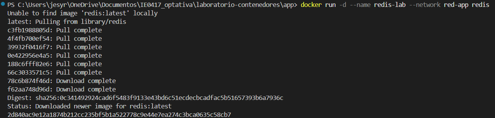

En este caso Docker descargó automáticamente la imagen de Redis porque no estaba instalada localmente.

Redis es una base de datos muy ligera que funciona almacenando datos en memoria. En este laboratorio se utilizó únicamente para simular una base de datos con la que una aplicación podría comunicarse.

---

# Verificación del contenedor

Luego verifiqué que el contenedor estuviera funcionando correctamente utilizando:

```bash
docker ps
```

Resultado:

```powershell
PS C:\Users\jesyr\OneDrive\Documentos\IE0417_optativa\laboratorio-contenedores\app> docker ps

CONTAINER ID   IMAGE     COMMAND                  CREATED         STATUS         PORTS      NAMES
2d840ac9e12a   redis     "docker-entrypoint.s…"   7 seconds ago   Up 7 seconds   6379/tcp   redis-lab
```

Imagen:

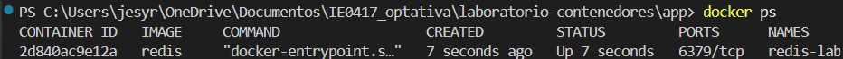

Aquí pude confirmar que el contenedor `redis-lab` estaba activo y funcionando correctamente.

---

# Conexión entre contenedores

Después ejecuté otro contenedor temporal para conectarme al servidor Redis.

Comando utilizado:

```bash
docker run -it --name cliente-redis --network red-app redis redis-cli -h redis-lab
```

Resultado:

```powershell
PS C:\Users\jesyr\OneDrive\Documentos\IE0417_optativa\laboratorio-contenedores\app> docker run -it --name cliente-redis --network red-app redis redis-cli -h redis-lab
```

Dentro del cliente Redis ejecuté:

```bash
ping
```

Respuesta obtenida:

```bash
PONG
```

Luego probé guardar información:

```bash
set curso IE0417
```

Resultado:

```bash
OK
```

Después recuperé el valor almacenado:

```bash
get curso
```

Resultado:

```bash
"IE0417"
```

Imagen:

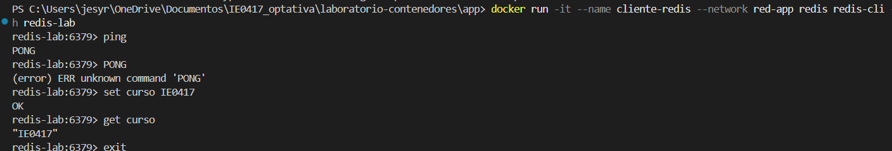

- `redis-lab` representa el servidor Redis.
- `cliente-redis` representa una aplicación o cliente que necesita conectarse a la base de datos.
- Ambos contenedores pudieron comunicarse porque estaban conectados a la misma red Docker.

El comando:

```bash
redis-cli -h redis-lab
```

permitió conectarme utilizando directamente el nombre del contenedor `redis-lab` sin necesidad de usar direcciones IP.

Cuando escribí `ping`, Redis respondió con `PONG`, esto significa que la conexión entre ambos contenedores funcionó correctamente.

Este ejemplo demuestra cómo una aplicación puede comunicarse con otro servicio dentro de Docker usando redes y nombres de contenedores.

---

# Limpieza de contenedores y red

Finalmente detuve y eliminé los contenedores y también eliminé la red creada.

Comandos utilizados:

```bash
docker stop redis-lab

docker rm redis-lab

docker rm cliente-redis

docker network rm red-app
```

Resultado:

```powershell
PS C:\Users\jesyr\OneDrive\Documentos\IE0417_optativa\laboratorio-contenedores\app> docker stop redis-lab
redis-lab

PS C:\Users\jesyr\OneDrive\Documentos\IE0417_optativa\laboratorio-contenedores\app> docker rm redis-lab
redis-lab

PS C:\Users\jesyr\OneDrive\Documentos\IE0417_optativa\laboratorio-contenedores\app> docker rm cliente-redis
cliente-redis

PS C:\Users\jesyr\OneDrive\Documentos\IE0417_optativa\laboratorio-contenedores\app> docker network rm red-app
red-app
```

Imagen:

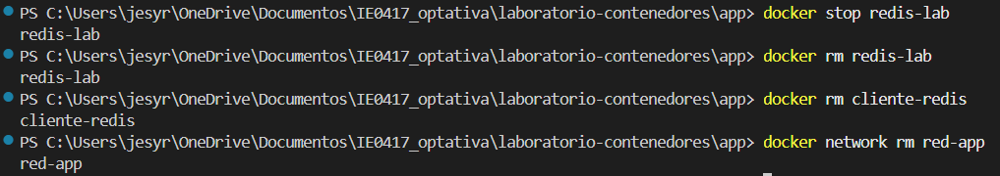

---

# Comunicación entre servicios

## ¿Qué es Redis en este ejemplo?

Redis funciona como una base de datos simple utilizada para almacenar información. En este laboratorio se utilizó únicamente como ejemplo para simular cómo una aplicación puede conectarse a otro servicio.

---

## ¿Qué representa redis-lab?

`redis-lab` representa el contenedor que actúa como servidor de base de datos Redis.

---

## ¿Cómo se conectó el cliente al servidor?

El cliente se conectó usando:

```bash
redis-cli -h redis-lab
```

El parámetro `-h redis-lab` indica el nombre del contenedor servidor al que se quería conectar.

---

## ¿Qué significa recibir PONG?

Cuando ejecuté:

```bash
ping
```

Redis respondió:

```bash
PONG
```

Esto significa que el cliente pudo comunicarse correctamente con el servidor Redis y que la conexión estaba funcionando.

---

## ¿Qué enseñanza deja este ejemplo sobre aplicaciones con varios contenedores?

Este ejemplo demuestra que una aplicación puede separarse en varios servicios independientes.

Por ejemplo

- un contenedor puede tener la aplicación web
- otro la base de datos
- otro servicios adicionales

Todos pueden comunicarse entre sí usando una red Docker.

---

# Preguntas de reflexión

## 1. ¿Por qué una aplicación web podría necesitar comunicarse con una base de datos?

Porque muchas aplicaciones necesitan guardar información, consultar datos o actualizar registros. La base de datos permite almacenar toda esa información de forma organizada.

---

## 2. ¿Por qué ambos contenedores deben estar en la misma red?

Porque Docker necesita que los contenedores compartan una red para poder comunicarse entre sí utilizando nombres internos.

---

## 3. ¿Qué ventaja tiene separar servicios en contenedores distintos?

Permite organizar mejor la aplicación, facilitar el mantenimiento y actualizar servicios sin afectar los demás contenedores.

---

## 4. ¿Qué limitación tiene hacerlo manualmente con varios comandos docker run?

Se vuelve más complicado administrar muchos contenedores manualmente. Por eso herramientas como Docker Compose ayudan a automatizar toda la configuración.