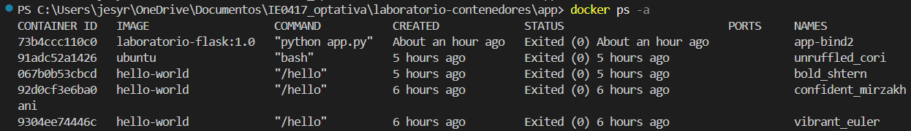
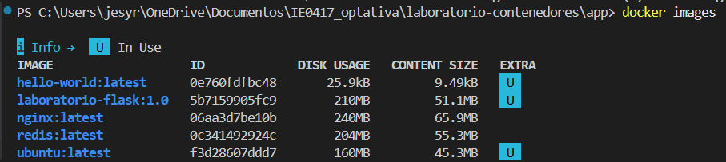
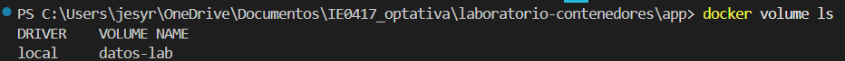
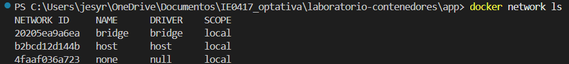
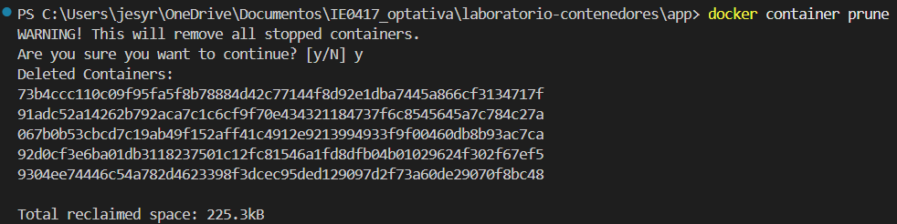
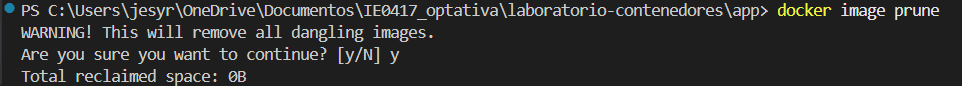
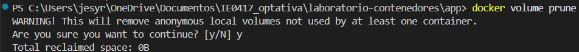
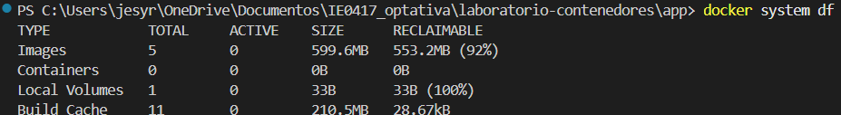
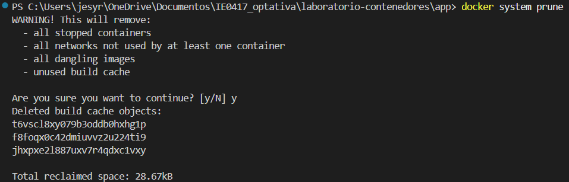

# Parte 14: Limpieza del ambiente

## Objetivos

- Limpiar contenedores, imágenes, volúmenes y redes que no se estén usando.
- Revisar el estado del espacio utilizado por Docker.
- Identificar recursos innecesarios dentro del sistema Docker.

---

# Listado de recursos en Docker

Primero revisé todos los recursos que tenía creados en Docker.

## Contenedores

```bash
docker ps -a
```

Resultado:

```powershell
CONTAINER ID   IMAGE                   COMMAND           STATUS
73b4ccc110c0   laboratorio-flask:1.0   "python app.py"   Exited
91adc52a1426   ubuntu                  "bash"            Exited
067b0b53cbcd   hello-world             "/hello"          Exited
92d0cf3e6ba0   hello-world             "/hello"          Exited
9304ee74446c   hello-world             "/hello"          Exited
```

Imagen:



---

## Imágenes

```bash
docker images
```

Resultado:

```text
hello-world:latest
laboratorio-flask:1.0
nginx:latest
redis:latest
ubuntu:latest
```

Imagen:



---

## Volúmenes

```bash
docker volume ls
```

Resultado:

```text
datos-lab
```

Imagen:



---

## Redes

```bash
docker network ls
```

Resultado:

```text
bridge
host
none
```

Imagen:



---

# Limpieza de recursos

## Eliminar contenedores detenidos

```bash
docker container prune
```

Resultado:

```text
Deleted Containers:
73b4ccc110c0
91adc52a1426
067b0b53cbcd
92d0cf3e6ba0
9304ee74446c

Total reclaimed space: 225.3kB
```

Imagen:



---

## Eliminar imágenes no utilizadas

```bash
docker image prune
```

Resultado:

```text
Total reclaimed space: 0B
```

Imagen:



---

## Eliminar volúmenes no utilizados

```bash
docker volume prune
```

Resultado:

```text
Total reclaimed space: 0B
```

Imagen:



---

## Revisar uso de espacio en Docker

```bash
docker system df
```

Resultado:

```text
TYPE            TOTAL     ACTIVE    SIZE      RECLAIMABLE
Images          5         0         599.6MB   553.2MB
Containers      0         0         0B        0B
Local Volumes   1         0         33B       33B
Build Cache     11        0         210.5MB   28.67kB
```

Imagen:



---

## Limpieza general del sistema

```bash
docker system prune
```

Resultado:

```text
Deleted build cache objects
Total reclaimed space: 28.67kB
```

Imagen:



---

# Diferencia entre tipos de limpieza

## Contenedores
Son instancias en ejecución o detenidas de una imagen.  
Cuando se eliminan, solo se borra la ejecución, no la imagen.

---

## Imágenes
Son las plantillas base para crear contenedores.  
Eliminar imágenes libera espacio, pero elimina la posibilidad de crear nuevos contenedores sin volver a descargarlas.

---

## Volúmenes
Son espacios donde se guardan datos persistentes.  
Eliminar volúmenes puede significar pérdida de información guardada por aplicaciones.

---

# Recursos que quedaron creados

Antes de la limpieza existían:

- Contenedores detenidos (varios `hello-world`, `ubuntu`, etc.)
- Imágenes descargadas (`nginx`, `redis`, `ubuntu`, `flask`)
- Un volumen llamado `datos-lab`
- Redes por defecto de Docker

Después de la limpieza:

- Se eliminaron contenedores detenidos
- Se liberó cache del sistema
- Se mantuvieron imágenes importantes
- El volumen solo se eliminaría si no estaba en uso

---

# Preguntas de reflexión

## 1. ¿Por qué Docker puede consumir mucho espacio en disco?

Porque guarda imágenes, capas, contenedores detenidos, volúmenes y cache que se acumulan con el tiempo.

---

## 2. ¿Qué diferencia hay entre eliminar un contenedor y eliminar una imagen?

Eliminar un contenedor solo borra la ejecución.  
Eliminar una imagen borra la base completa para crear contenedores.

---

## 3. ¿Por qué se debe tener cuidado al eliminar volúmenes?

Porque los volúmenes pueden contener datos importantes de aplicaciones, como bases de datos o archivos persistentes.

---

## 4. ¿Qué buenas prácticas aplicaría para mantener limpio su ambiente local?

- Eliminar contenedores que ya no uso.
- Usar `docker system df` para revisar espacio.
- Limpiar imágenes antiguas.
- Evitar dejar volúmenes innecesarios.
- Usar `docker system prune` con cuidado.
