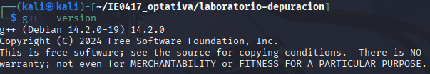
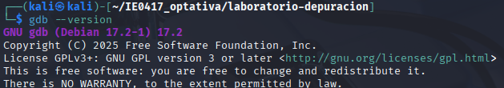
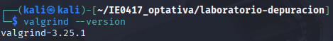
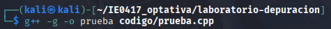
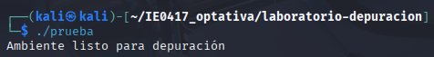

# Parte 1: instalación y verificación del ambiente

## Objetivo

Verificar que el entorno de trabajo cuenta con las herramientas necesarias para compilar, ejecutar y depurar programas en C++.

---

## Sistema operativo utilizado

Kali Linux

---

## Verificación de las herramientas

### Verificación de g++

Comando ejecutado:

```bash
g++ --version
```

Evidencia:



---

### Verificación de gdb

Comando ejecutado:

```bash
gdb --version
```

Evidencia:



---

### Verificación de valgrind

Comando ejecutado:

```bash
valgrind --version
```

Evidencia:



---

## Programa de prueba

Archivo creado:

```text
codigo/prueba.cpp
```

Codigo utilizado:

```cpp
#include <iostream>

int main() {
    std::cout << "Ambiente listo para depuración" << std::endl;
    return 0;
}
```

---

## Compilación del programa

Comando ejecutado:

```bash
g++ -g -o prueba codigo/prueba.cpp
```

Explicación:

- `g++` compila el programa
- `-g` agrega símbolos de depuración para usar con gdb
- `-o prueba` crea el ejecutable llamado `prueba`

Evidencia:



---

## Ejecución del programa

Comando ejecutado:

```bash
./prueba
```

Resultado obtenido:

```text
Ambiente listo para depuración
```

Evidencia:



---

# Explicación de herramientas

## g++

`g++` es el compilador de C++ utilizado para transformar el código fuente en un programa ejecutable.


## gdb

`gdb` es un depurador que permite ejecutar programas paso a paso, inspeccionar variables y analizar errores.


## valgrind

`valgrind` es una herramienta utilizada para detectar errores de memoria, perdida de memoria y accesos inválidos.

---

# Preguntas de reflexión

## 1. ¿Para qué sirve g++?

Sirve para compilar programas escritos en C++ y generar ejecutables.

## 2. ¿Para qué sirve gdb?

Sirve para depurar programas y analizar errores durante la ejecución.

## 3. ¿Para qué sirve valgrind?

Sirve para detectar errores relacionados con memoria dinámica.

## 4. ¿Por qué se recomienda compilar con -g al depurar?

Porque agrega información de depuración que permite a herramientas como gdb identificar líneas y variables del programa.

## 5. ¿Qué diferencia hay entre compilar un programa y depurarlo?

Compilar transforma el código fuente en un ejecutable. Depurar consiste en analizar el comportamiento del programa para encontrar y corregir errores.
