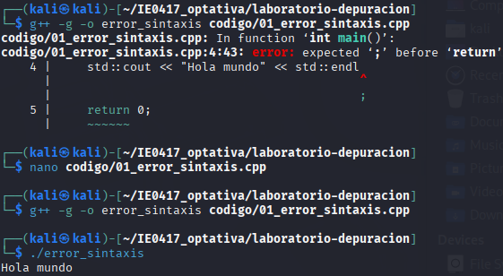
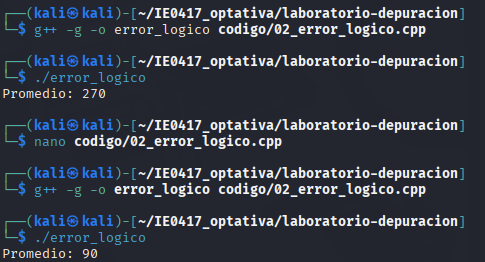

# Parte 2: tipos de errores

# Ejercicio 1: error de sintaxis

## Código original

Archivo:

```text
codigo/01_error_sintaxis.cpp
```

Código utilizado:

```cpp
#include <iostream>

int main() {
    std::cout << "Hola mundo" << std::endl
    return 0;
}
```

---

## Compilación del programa

Comando ejecutado:

```bash
g++ -g -o error_sintaxis codigo/01_error_sintaxis.cpp
```

---

## Error observado

El compilador mostró un error indicando que faltaba un punto y coma antes de `return`.

Evidencia:



---

## Análisis del problema

El error ocurrió porque faltaba un `;` al final de la línea:

```cpp
std::cout << "Hola mundo" << std::endl
```

---

## Corrección realizada

Código corregido:

```cpp
#include <iostream>

int main() {
    std::cout << "Hola mundo" << std::endl;
    return 0;
}
```

---

## Compilación corregida

Comando ejecutado:

```bash
g++ -g -o error_sintaxis codigo/01_error_sintaxis.cpp
```

---

## Ejecución del programa

Comando ejecutado:

```bash
./error_sintaxis
```

Resultado obtenido:

```text
Hola mundo
```

---

# Reflexión del ejercicio 1

## 1. ¿Este error fue detectado antes o durante la ejecución?

Fue detectado durante la compilación.


## 2. ¿Qué herramienta detectó el error?

El compilador `g++`.


## 3. ¿Por qué este tipo de error suele ser más fácil de corregir que un error lógico?

Porque el compilador normalmente indica la línea exacta donde ocurre el problema.

---

# Ejercicio 2: error lógico

## Código original

Archivo:

```text
codigo/02_error_logico.cpp
```

Código utilizado:

```cpp
#include <iostream>
#include <vector>

double calcular_promedio(const std::vector<int>& notas) {
    int suma = 0;

    for (int nota : notas) {
        suma += nota;
    }

    return suma;
}

int main() {
    std::vector<int> notas = {80, 90, 100};

    double promedio = calcular_promedio(notas);

    std::cout << "Promedio: " << promedio << std::endl;

    return 0;
}
```

---

## Compilación del programa

Comando ejecutado:

```bash
g++ -g -o error_logico codigo/02_error_logico.cpp
```

---

## Ejecución del programa

Comando ejecutado:

```bash
./error_logico
```

---

## Resultado observado

Resultado obtenido:

```text
Promedio: 270
```

Resultado esperado:

```text
Promedio: 90
```

Evidencia:



---

## Análisis del problema

El programa suma correctamente las notas, pero no divide la suma entre la cantidad de elementos.

---

## Corrección realizada

Código corregido:

```cpp
#include <iostream>
#include <vector>

double calcular_promedio(const std::vector<int>& notas) {
    int suma = 0;

    for (int nota : notas) {
        suma += nota;
    }

    return static_cast<double>(suma) / notas.size();
}

int main() {
    std::vector<int> notas = {80, 90, 100};

    double promedio = calcular_promedio(notas);

    std::cout << "Promedio: " << promedio << std::endl;

    return 0;
}
```

---

## Compilación corregida

Comando ejecutado:

```bash
g++ -g -o error_logico codigo/02_error_logico.cpp
```

---

## Ejecución corregida

Comando ejecutado:

```bash
./error_logico
```

Resultado obtenido:

```text
Promedio: 90
```

---

# Reflexión del ejercicio 2

## 1. ¿Por qué el compilador no detectó este error?

Porque el código era válido y no tenía errores de sintaxis.


## 2. ¿Por qué este error se considera lógico?

Porque el programa ejecuta instrucciones incorrectas y produce un resultado equivocado.


## 3. ¿Qué estrategia usó para encontrarlo?

Comparar el resultado esperado con el resultado obtenido.

## 4. ¿Qué pruebas adicionales podría hacer?

- Probar con más notas.
- Probar con diferentes cantidades de elementos.
