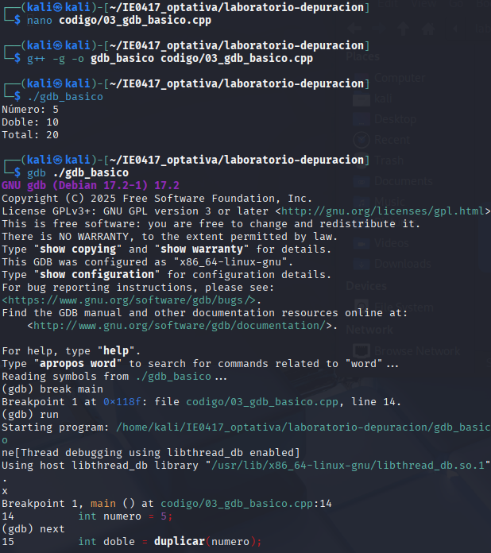

# Parte 3: introducción a gdb

## Objetivo

Usar `gdb` para ejecutar un programa paso a paso e inspeccionar variables.

---

## Código utilizado

Archivo:

```text
codigo/03_gdb_basico.cpp
```

Código:

```cpp
#include <iostream>

int duplicar(int x) {
    int resultado = x * 2;
    return resultado;
}

int sumar(int a, int b) {
    int resultado = a + b;
    return resultado;
}

int main() {
    int numero = 5;
    int doble = duplicar(numero);
    int total = sumar(doble, 10);

    std::cout << "Número: " << numero << std::endl;
    std::cout << "Doble: " << doble << std::endl;
    std::cout << "Total: " << total << std::endl;

    return 0;
}
```

---

## Compilación del programa

Comando ejecutado:

```bash
g++ -g -o gdb_basico codigo/03_gdb_basico.cpp
```

---

## Ejecución normal

Comando ejecutado:

```bash
./gdb_basico
```

Resultado obtenido:

```text
Número: 5
Doble: 10
Total: 20
```

---

## Uso de gdb

Comando para iniciar gdb:

```bash
gdb ./gdb_basico
```

Comandos utilizados dentro de gdb:

```gdb
break main
run
next
next
print numero
next
print doble
next
print total
continue
quit
```

---

## Explicación de comandos

### ¿Para qué sirve `-g`?

La opción `-g` agrega símbolos de depuración para que gdb pueda identificar líneas, funciones y variables.


### ¿Qué hace `break main`?

Crea un breakpoint en la función `main`.

### ¿Qué hace `run`?

Ejecuta el programa dentro de gdb.

### ¿Qué hace `next`?

Avanza a la siguiente línea sin entrar dentro de funciones.

### ¿Qué hace `print`?

Muestra el valor de una variable durante la ejecución.

## Valores observados

```text
numero = 5
doble = 10
total = 20
```

---

## Evidencia



---

# Preguntas de reflexión

## 1. ¿Qué es un breakpoint?

Es un punto donde la ejecución del programa se detiene para analizar su estado.


## 2. ¿Qué diferencia hay entre ejecutar el programa normalmente y ejecutarlo dentro de gdb?

Dentro de gdb es posible ejecutar el programa paso a paso e inspeccionar variables.


## 3. ¿Qué ventaja tiene inspeccionar variables mientras el programa se ejecuta?

Permite identificar errores y verificar cómo cambian los valores del programa.


## 4. ¿Por qué `next` no entra dentro de las funciones?

Porque `next` ejecuta la función completa y avanza a la siguiente línea del código actual.
