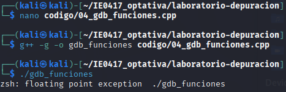
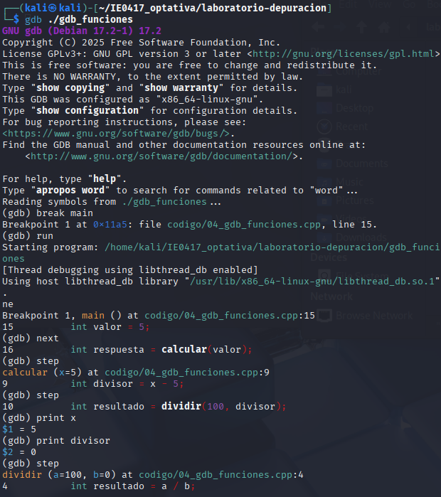
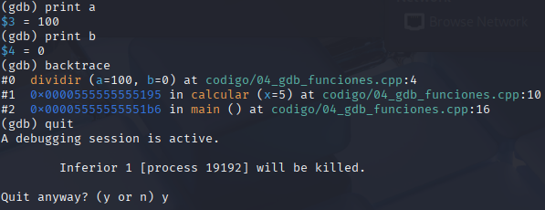
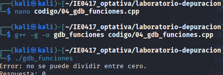

# Parte 4: step, next y backtrace

## Objetivo

Comprender la diferencia entre `step` y `next`, además de usar `backtrace` para revisar la pila de llamadas.

---

## Código utilizado

Archivo:

```text
codigo/04_gdb_funciones.cpp
```

Código original:

```cpp
#include <iostream>

int dividir(int a, int b) {
    int resultado = a / b;
    return resultado;
}

int calcular(int x) {
    int divisor = x - 5;
    int resultado = dividir(100, divisor);
    return resultado;
}

int main() {
    int valor = 5;
    int respuesta = calcular(valor);

    std::cout << "Respuesta: " << respuesta << std::endl;

    return 0;
}
```

---

## Compilación del programa

Comando ejecutado:

```bash
g++ -g -o gdb_funciones codigo/04_gdb_funciones.cpp
```

---

## Ejecución normal

Comando ejecutado:

```bash
./gdb_funciones
```

Resultado observado:

```text
floating point exception
```

Evidencia:



---

## Uso de gdb

Comando ejecutado:

```bash
gdb ./gdb_funciones
```

Comandos utilizados dentro de gdb:

```gdb
break main
run
next
step
step
print x
print divisor
step
print a
print b
backtrace
quit
```

---

## Evidencia del uso de gdb





---

## Análisis del problema

Valores observados:

```text
x = 5
divisor = 0
a = 100
b = 0
```

El programa intentó realizar una división entre cero.

---

## Diferencia entre `next` y `step`

- `next` avanza línea por línea sin entrar dentro de funciones.
- `step` entra dentro de las funciones para ejecutarlas paso a paso.

---

## Resultado de `backtrace`

`backtrace` mostró la pila de llamadas del programa y permitió identificar cómo se llegó a la función `dividir`.

---

## Corrección realizada

Se agregó una validación para evitar dividir entre cero.

Código corregido:

```cpp
#include <iostream>

int dividir(int a, int b) {

    if (b == 0) {
        std::cout << "Error: no se puede dividir entre cero." << std::endl;
        return 0;
    }

    int resultado = a / b;
    return resultado;
}

int calcular(int x) {
    int divisor = x - 5;
    int resultado = dividir(100, divisor);
    return resultado;
}

int main() {
    int valor = 5;
    int respuesta = calcular(valor);

    std::cout << "Respuesta: " << respuesta << std::endl;

    return 0;
}
```

---

## Recompilación del programa

Comando ejecutado:

```bash
g++ -g -o gdb_funciones codigo/04_gdb_funciones.cpp
```

---

## Resultado final

Comando ejecutado:

```bash
./gdb_funciones
```

Resultado obtenido:

```text
Error: no se puede dividir entre cero.
Respuesta: 0
```

Evidencia:



---

# Preguntas de reflexión

## 1. ¿Qué diferencia observó entre `next` y `step`?

`next` no entra dentro de las funciones, mientras que `step` sí permite entrar y ejecutar cada línea.


## 2. ¿Para qué sirve `backtrace`?

Sirve para mostrar la pila de llamadas del programa.


## 3. ¿Cuál fue la causa del error?

El divisor tenía valor 0 y el programa intentó dividir entre cero.

## 4. ¿Por qué este error es de tiempo de ejecución?

Porque el programa compila correctamente, pero falla mientras se ejecuta.


## 5. ¿Cómo podría prevenirse este tipo de error desde el diseño del programa?

Validando los valores antes de realizar operaciones peligrosas como divisiones.
