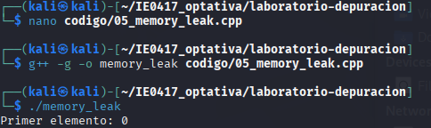
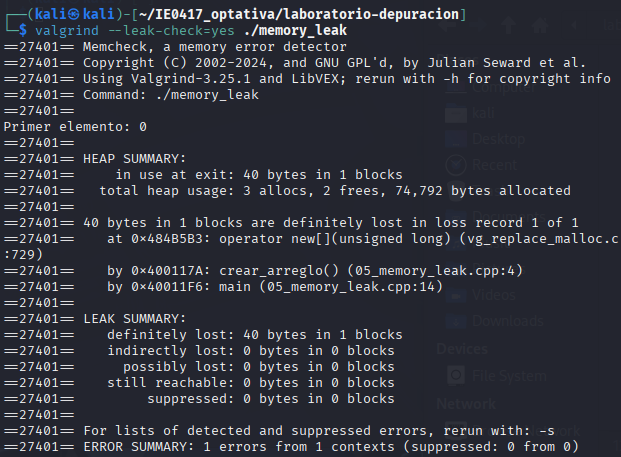
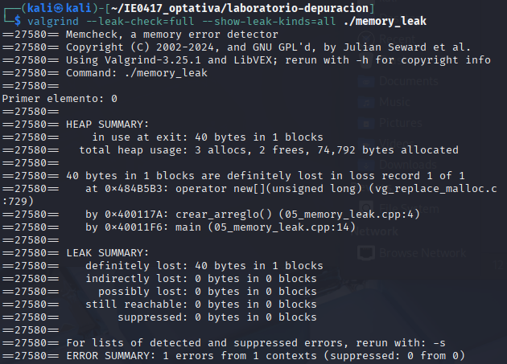
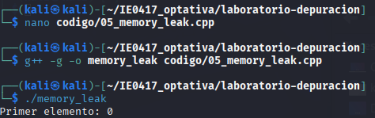
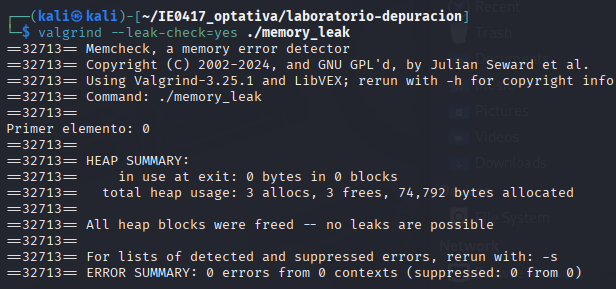
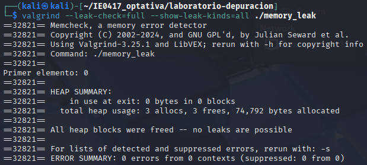

# Parte 5: análisis de memoria con valgrind

## Ejercicio 1: pérdida de memoria

---

## Código original

```cpp
#include <iostream>

void crear_arreglo() {
    int* datos = new int[10];

    for (int i = 0; i < 10; i++) {
        datos[i] = i * 2;
    }

    std::cout << "Primer elemento: " << datos[0] << std::endl;
}

int main() {
    crear_arreglo();
    return 0;
}
```
---

### Comando de compilación

```bash
g++ -g -o memory_leak codigo/05_memory_leak.cpp
```

### Comando de ejecución

```bash
./memory_leak
```

### Error observado

El programa funciona aparentemente bien, pero tiene una pérdida de memoria porque nunca libera el arreglo dinámico reservado con `new[]`.

### Herramienta usada para depurar

```bash
valgrind --leak-check=yes ./memory_leak
```

y también:

```bash
valgrind --leak-check=full --show-leak-kinds=all ./memory_leak
```

### Explicación del problema

El programa reserva memoria dinámica utilizando `new[]`, pero nunca la libera.

Valgrind reporta:

```txt
definitely lost
```

Esto significa que la memoria quedó inaccesible y no puede ser liberada.

### Corrección realizada

Se agregó:

```cpp
delete[] datos;
```

al final de la función `crear_arreglo()`.

### Código corregido

```cpp
#include <iostream>

void crear_arreglo() {
    int* datos = new int[10];

    for (int i = 0; i < 10; i++) {
        datos[i] = i * 2;
    }

    std::cout << "Primer elemento: " << datos[0] << std::endl;

    delete[] datos;
}

int main() {
    crear_arreglo();
    return 0;
}
```
---

## Evidencia de que el programa corregido funciona

#### Ejecución normal



#### Valgrind básico



#### Valgrind detallado



---

## Reflexión

Este ejercicio demuestra la importancia de liberar correctamente la memoria dinámica para evitar pérdidas de memoria.

## Preguntas de reflexión

### 1. ¿Qué es una pérdida de memoria?

Es un problema que ocurre cuando un programa reserva memoria dinámica y nunca la libera.

### 2. ¿Por qué el programa puede terminar aparentemente bien aunque tenga una pérdida de memoria?

Porque el sistema operativo recupera la memoria al finalizar el proceso.

### 3. ¿Qué significa liberar memoria dinámica?

Significa devolver al sistema la memoria reservada utilizando `delete` o `delete[]`.

### 4. ¿Por qué se usa `delete[]` y no solo `delete`?

Porque la memoria fue reservada como un arreglo usando `new[]`.

### 5. ¿Qué tipo de problemas podrían aparecer en programas grandes si no se libera memoria?

El programa podría consumir demasiada memoria y eventualmente fallar.

## Ejercicio 2: acceso fuera de límites

### Código original

```cpp
#include <iostream>

int main() {
    int* arreglo = new int[5];

    for (int i = 0; i <= 5; i++) {
        arreglo[i] = i * 10;
    }

    std::cout << "Programa finalizado" << std::endl;

    delete[] arreglo;

    return 0;
}
```

### Comando de compilación

```bash
g++ -g -o invalid_access codigo/06_invalid_access.cpp
```

### Comando de ejecución

```bash
./invalid_access
```

### Error observado

El programa aparentemente funciona correctamente, pero escribe fuera de los límites del arreglo.

### Herramienta usada para depurar

```bash
valgrind --leak-check=full ./invalid_access
```

### Explicación del problema

El ciclo utiliza:

```cpp
i <= 5
```

pero el arreglo tiene posiciones válidas únicamente entre `0` y `4`.

Valgrind reporta:

```txt
Invalid write
```

porque el programa intenta escribir fuera de la memoria reservada.

### Corrección realizada

Se corrigió el ciclo usando:

```cpp
i < 5
```

### Código corregido

```cpp
#include <iostream>

int main() {
    int* arreglo = new int[5];

    for (int i = 0; i < 5; i++) {
        arreglo[i] = i * 10;
    }

    std::cout << "Programa finalizado" << std::endl;

    delete[] arreglo;

    return 0;
}
```

### Evidencia de que el programa corregido funciona

#### Ejecución normal



#### Valgrind con error



#### Resultado corregido



### Reflexión

Este ejercicio demuestra que un programa puede parecer correcto aunque tenga errores de acceso inválido a memoria.

## Preguntas de reflexión

### 1. ¿Por qué el programa podría no fallar aunque acceda fuera del arreglo?

Porque el acceso puede ocurrir en una zona de memoria que no produce un error inmediato.

### 2. ¿Qué significa escribir fuera de los límites de un arreglo?

Significa acceder a posiciones que no pertenecen al arreglo reservado.

### 3. ¿Por qué este tipo de error es peligroso?

Porque puede corromper memoria y causar errores difíciles de detectar.

### 4. ¿Qué diferencia hay entre un error visible y un comportamiento indefinido?

Un error visible produce un fallo evidente, mientras que el comportamiento indefinido genera resultados impredecibles.
