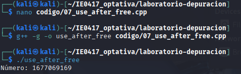
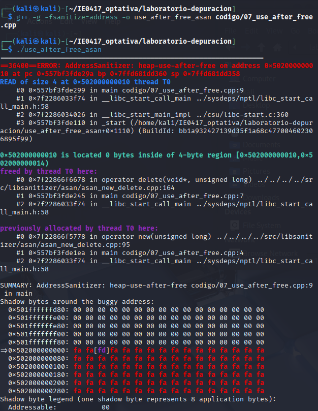
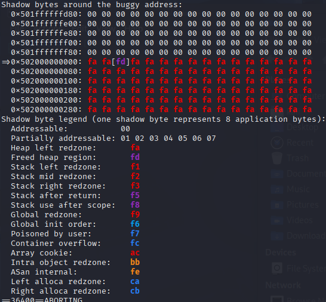

# Parte 6: AddressSanitizer

## Ejercicio: uso de memoria después de liberarla

### Código original

```cpp
#include <iostream>

int main() {
    int* numero = new int;
    *numero = 42;

    delete numero;

    std::cout << "Número: " << *numero << std::endl;

    return 0;
}
```

### Comando de compilación

```bash
g++ -g -o use_after_free codigo/07_use_after_free.cpp
```

### Comando de ejecución

```bash
./use_after_free
```

### Error observado

El programa puede ejecutarse aparentemente bien aunque acceda a memoria que ya fue liberada.

Esto produce comportamiento indefinido.

### Herramienta usada para depurar

```bash
g++ -g -fsanitize=address -o use_after_free_asan codigo/07_use_after_free.cpp
```

y luego:

```bash
./use_after_free_asan
```

### Explicación del problema

El programa libera memoria utilizando:

```cpp
delete numero;
```

pero después intenta acceder nuevamente al puntero:

```cpp
std::cout << "Número: " << *numero << std::endl;
```

AddressSanitizer reporta:

```txt
heap-use-after-free
```

Esto significa que el programa intenta usar memoria después de haber sido liberada.

### Línea donde ocurre el error

El error ocurre en:

```cpp
std::cout << "Número: " << *numero << std::endl;
```

### Corrección realizada

Se movió la impresión antes de liberar la memoria y luego se asignó:

```cpp
numero = nullptr;
```

para evitar reutilizar el puntero.

### Código corregido

```cpp
#include <iostream>

int main() {
    int* numero = new int;
    *numero = 42;

    std::cout << "Número: " << *numero << std::endl;

    delete numero;
    numero = nullptr;

    return 0;
}
```

### Evidencia de que el programa corregido funciona

#### Ejecución normal



#### Ejecución con AddressSanitizer



#### Resultado después de corregir



### Reflexión

Este ejercicio demuestra que algunos errores de memoria pueden no ser visibles durante una ejecución normal, pero herramientas como AddressSanitizer permiten detectarlos rápidamente.

## Preguntas de reflexión

### 1. ¿Qué significa usar memoria después de liberarla?

Significa intentar acceder a memoria que ya fue liberada utilizando `delete`.

### 2. ¿Por qué este error puede ser difícil de detectar sin herramientas?

Porque el programa puede seguir funcionando aparentemente bien aunque exista comportamiento indefinido.

### 3. ¿Qué ventaja tiene AddressSanitizer sobre ejecutar el programa normalmente?

Detecta automáticamente errores de memoria y muestra información detallada sobre el problema.

### 4. ¿Qué diferencia observó entre el reporte de `valgrind` y el reporte de AddressSanitizer?

AddressSanitizer muestra los errores de manera inmediata y con información muy detallada durante la ejecución.

### 5. ¿Por qué es buena práctica asignar `nullptr` después de liberar un puntero?

Porque evita reutilizar accidentalmente un puntero que ya no apunta a memoria válida.
