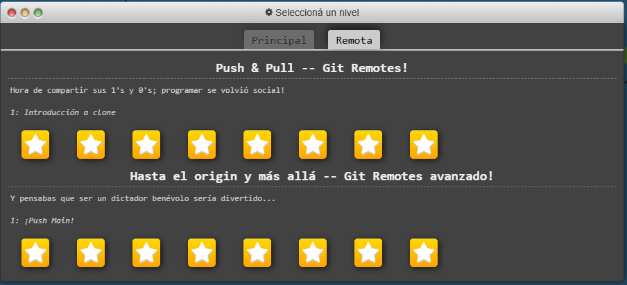

# Laboratorio 1 – Parte 1: Git

## Nombre del estudiante
Jesy Pricilla Rivera Duarte

## Conceptos aprendidos

Para esta actividad utilicé la plataforma Learn Git Branching para practicar los comandos de Git.

En este laboratorio aprendí los siguientes conceptos:

- **git commit**: Sirve para guardar cambios en el historial del proyecto.
- **git branch**: Permite crear ramas, que son versiones paralelas del proyecto para trabajar sin afectar la principal.
- **git checkout**: Se usa para moverse entre ramas o commits.
- **git merge**: Une los cambios de una rama con otra.
- **git rebase**: Reorganiza los commits para mantener un orden.
- **HEAD**: Es un puntero que indica en que commit o rama estamos trabajando en este momento.
- **Detached HEAD**: Pasa cuando HEAD apunta directamente a un commit y no a una rama.
- **git log**: Muestra el historial de commits.
- **^ y ~**: Sirven para moverse entre commits anteriores.
  - `^` → un commit atrás  
  - `~num` → varios commits atrás  
- **git reset**: Permite deshacer cambios moviendo el HEAD.
- **git revert**: Deshace un commit creando uno nuevo.
- **git cherry-pick**: Permite copiar commits específicos de una rama a otra.
- **git rebase -i**: Permite editar commits, como ordenarlos o combinarlos).
- **git commit --amend**: Modifica el último commit.

### Comandos en repositorios remotos

También aprendí a trabajar con repositorios remotos:

- **git clone**: Copia un repositorio remoto a mi computadora.
- **git fetch**: Descarga cambios del repositorio remoto sin aplicarlos.
- **git pull**: Descarga y aplica cambios automáticamente.
- **git pull --rebase**: Actualiza el repositorio manteniendo un historial más ordenado.
- **git push**: Envía cambios al repositorio remoto.

---

## Dificultades encontradas

La parte que más se me complicó fue el uso de **rebase** y **cherry-pick**, tanto en repositorios locales como remotos.

El comando **rebase** fue un poco difícil de entender porque cambia el orden del historial de commits. Me costó comprender cuándo usarlo en lugar de *merge* y cómo afectaba la estructura del proyecto. Además, entendí que reescribe el historial.

El comando **cherry-pick** también fue complicado, porque permite copiar commits específicos de una rama a otra. Por momentos fue algo confuso identificar correctamente cual commit tanía seleccionar y como aplicarlo sin generar errores.

En la parte remota, estas dificultades aumentaron porque ahora había que considerar también los cambios del repositorio en línea. Comandos como **git pull --rebase** me confundieron porque combinan varias acciones en una sola.

Por tanto, lo más difícil fue entender cómo se modifica el historial de commits tanto local como remoto.

---

## Reflexión final

Git es muy importante en proyectos reales porque permite trabajar en equipo sin sobrescribir el trabajo de otras personas, mantener un historial de cambios para revisar o recuperar versiones anteriores, permite organizar el proyecto usando ramas y se puede resolver errores sin perder información.

Herramientas como rebase y cherry-pick, aunque son más complejas, permiten un mejor control del historial del proyecto, es útil para mantener un código más limpio y ordenado.

Por eso, Git es una herramienta fundamental para el desarrollo de software, ya que, facilita la colaboración y mejora la organización del trabajo.

---

## Capturas de pantalla

