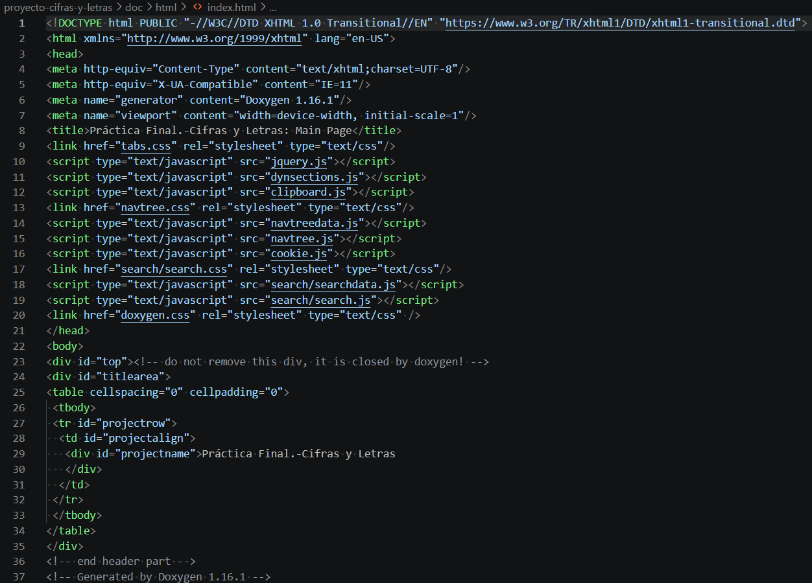
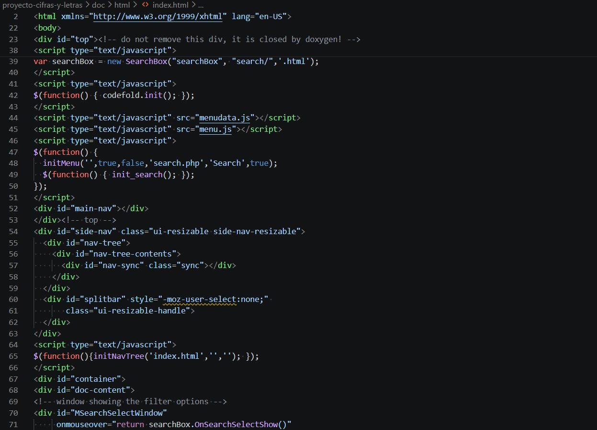
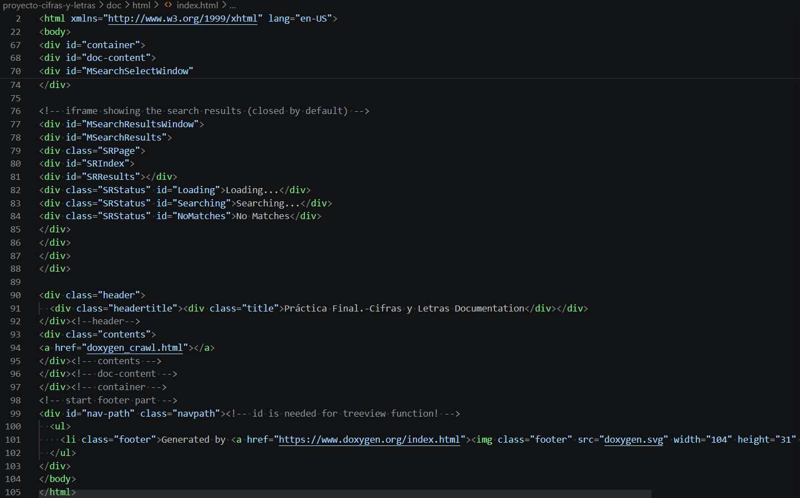
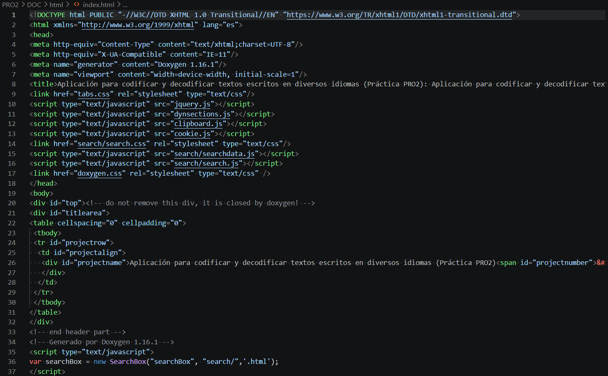
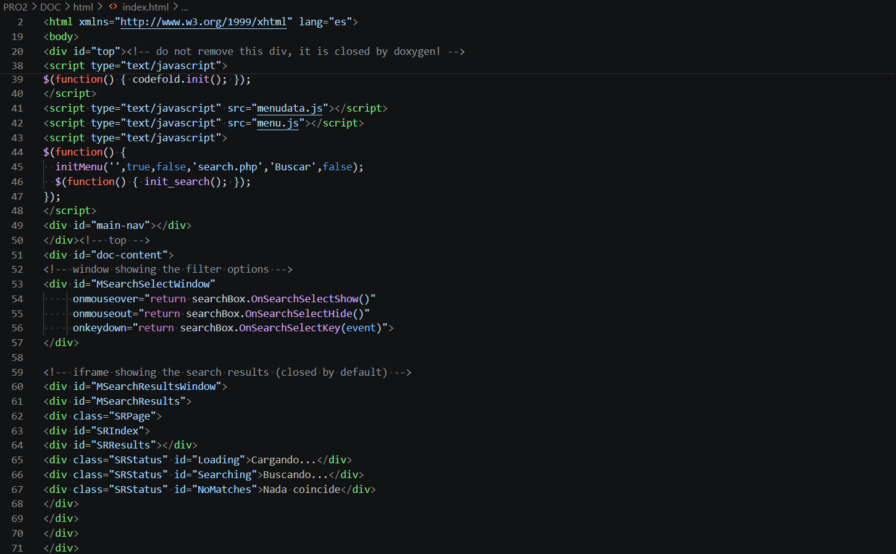
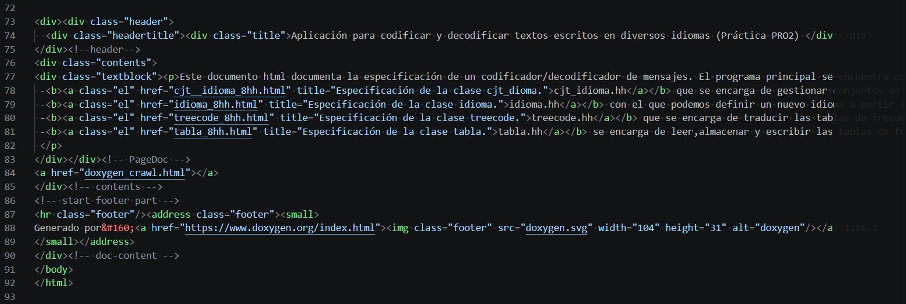

# Parte 2: Documentación de proyectos de software

## Nombre del estudiante
Jesy Pricilla Rivera Duarte

---

## Repositorios utilizados

- Repositorio 1:  
https://github.com/olivier-ba/proyecto-cifras-y-letras.git

- Repositorio 2:  
https://github.com/PolGs/PRO2.git

---

## Herramienta utilizada

Se utilizó la herramienta **Doxygen** para generar la documentación de ambos proyectos en C++.

---

## Pasos realizados

Para ambos repositorios se siguieron los mismos pasos:

1. Se buscó repositorios públicos en GitHub con código en C++ compatible con Doxygen.

2. Se clonaron los repositorios:
   git clone [URL repo 1]  
   git clone [URL repo 2]

3. Se abrieron los proyectos en Visual Studio Code.

4. Se instaló Doxygen.

5. En cada repositorio se modificó el archivo `Doxyfile` para que reconociera los archivos:
   En el primer repositorio:
   - OUTPUT_DIRECTORY = doc
   - INPUT = src include
   En el segundo repositorio:
   - INPUT = .
   - RECURSIVE = YES
   - FILE_PATTERNS = *.cc *.hh *.cpp *.h

6. Se ejecutó para cada proyecto en la terminal:
   doxygen Doxyfile

7. Se generó la documentación en:
   doc/html/index.html
   DOC/html/index.html

8. Se abrió cada documentación en el navegador para verificar su contenido.

---

## Verificación de la documentación

En ambos proyectos se comprobó que:

- La documentación es navegable.
- Incluye clases, funciones y archivos.
- Está organizada de forma clara.
- Permite entender la estructura del código.

---

## Problemas encontrados y soluciones

- Doxygen no detectaba archivos entonces se corrigió el FILE_PATTERNS
- Error "No files to be processed" para solucionarlo se corrigió el INPUT
- Errores con Graphviz pero no afectan la generación del HTML
- Algunos Doxyfile tenían rutas incorrectas, por eso se ajustaron para usar el directorio actual

---

## Capturas de pantalla

### Documentación generada en el repositorio 1:

### Documentación generada en el repositorio 2:

---

## Enlace a la documentación publicada

- Documentación repositorio 1:  
https://69d60c58b2d07f10377fed75--splendorous-pony-7b2664.netlify.app/

- Documentación repositorio 2:  
https://69d60d0c861257001ed8d5b1--splendorous-pony-7b2664.netlify.app/

---

## Reflexión final

La documentación es de suma importancia en el desarrollo de software porque permite comprender el funcionamiento del código de forma más rápida y eficiente. Las herramientas como Doxygen facilitan la generación automática de documentación estructurada, esto es realmente útil en proyectos grandes o colaborativos.

Igualmente, documentar el código mejora la comunicación y facilita el mantenimiento del sistema.