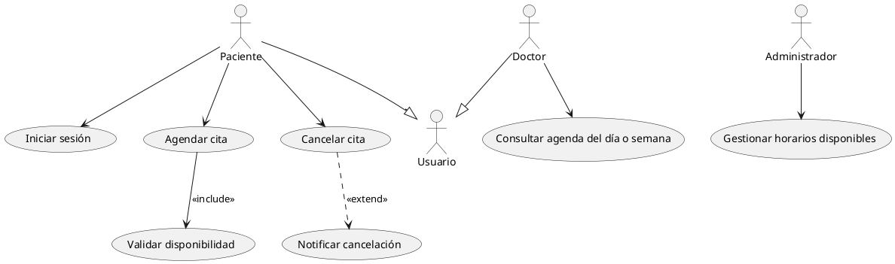

# Tarea 2: Análisis de requerimientos y modelado de casos de uso
## Curso: IE0417 Diseño de Software para Ingeniería
## Docente
Rafael Esteban Badilla Alvarado
## Nombre de la estudiante
Jesy Pricilla Rivera Duarte

## Escenario seleccionado
4. Sistema de reservas para consultorio médico

# a. Lista de requerimientos

## Requerimientos funcionales

1. El sistema debe permitir a los pacientes registrarse con sus datos personales.
2. El sistema debe permitir a los pacientes iniciar sesión.
3. El sistema debe permitir a los pacientes agendar citas médicas disponibles.
4. El sistema debe permitir a los pacientes cancelar o reprogramar citas.
5. El sistema debe permitir a doctores ver su agenda diaria de citas.
6. El sistema debe permitir a la persona administradora gestionar horarios disponibles de doctores.

## Requerimientos no funcionales

1. El sistema debe garantizar disponibilidad la mayor parte del tiempo (al menos 90%).
2. El sistema debe proteger la información del usuario por meido de la autenticación.
3. El sistema debe tener un tiempo de respuesta preferiblemente que sea menor a 2 segundos en operaciones simples o principales.

## Requerimiento técnico o de interfaz

1. El sistema debe contar con una interfaz web que sea accesible desde dispositivos móviles y computadoras.

# b. Casos de uso

## Caso de uso 1: Agendar cita médica

### Precondiciones  
- El paciente debe estar registrado en el sistema.
- El paciente debe haber iniciado sesión.

### Flujo principal

1. El paciente accede a la opción para agendar cita.
2. El sistema muestra cuales doctores están disponibles.
3. El paciente selecciona un(a) doctor(a) de preferencia.
4. El sistema muestra los horarios disponibles.
5. El paciente selecciona fecha y hora.
6. El sistema confirma la cita.

### Flujo alternativo

**Si no hay horarios disponibles**
- El sistema informa que no hay espacios disponibles.
- El paciente puede seleccionar diferente doctor(a) u horario.

### Postcondiciones
- La cita queda registrada en el sistema.

## Caso de uso 2: Cancelar cita médica

### Precondiciones
- El paciente debe haber iniciado sesión
- El paciente debe tener al menos una cita registrada.

### Flujo principal

1. El paciente accede a sus citas programadas.
2. El sistema muestra las citas programadas
3. El paciente selecciona una cita
4. El paciente elige la opción de cancelar.
5. El sistema pide confirmación.
6. El paciente confirma la cancelación.
7. El sistema elimina la cita.

### Flujo alternativo

**No se permite cancelación**
- El sistema informa que la cita no puede cancelarse porque falta 1 hora para la cita (debe de cancelarse con más tiempo).

### Postcondiciones
- La cita es eliminada del sistema

# c. Diagrama UML de casos de uso  

